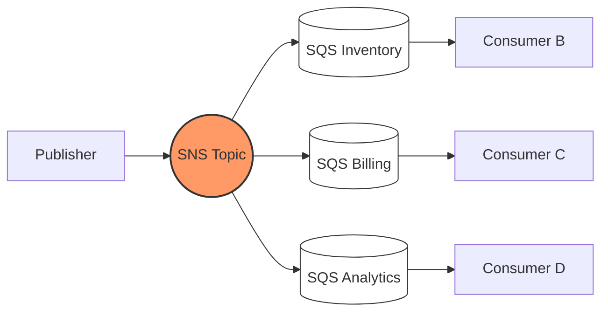

## SNS Fan-out to SQS

**Problem:** Service A needs to notify Services B, C, and D when an order is placed. Direct HTTP calls create tight coupling - if Service C is down, Service A either blocks or needs retry logic for every downstream consumer.

**Pattern:** Publish once to an SNS topic. Each downstream service owns its own SQS queue subscribed to that topic. SNS handles delivery, retries, and fan-out. Services consume independently at their own pace.



### Subscribing an SQS Queue to SNS (CLI)

```bash
aws sns subscribe \
  --topic-arn arn:aws:sns:eu-west-1:123456789012:order-events \
  --protocol sqs \
  --notification-endpoint arn:aws:sqs:eu-west-1:123456789012:billing-queue \
  --attributes '{"RawMessageDelivery": "true"}'
```

### SQS Queue Policy (Allow SNS to Push)

```json
{
  "Version": "2012-10-17",
  "Statement": [
    {
      "Effect": "Allow",
      "Principal": {"Service": "sns.amazonaws.com"},
      "Action": "sqs:SendMessage",
      "Resource": "arn:aws:sqs:eu-west-1:123456789012:billing-queue",
      "Condition": {
        "ArnEquals": {
          "aws:SourceArn": "arn:aws:sns:eu-west-1:123456789012:order-events"
        }
      }
    }
  ]
}
```

> **Gotcha:** Without `RawMessageDelivery: true`, SNS wraps your message in its own JSON envelope. Your consumer then has to unwrap `Message` from within an SNS notification object. Always enable raw delivery for SQS subscribers unless you need the SNS metadata.
