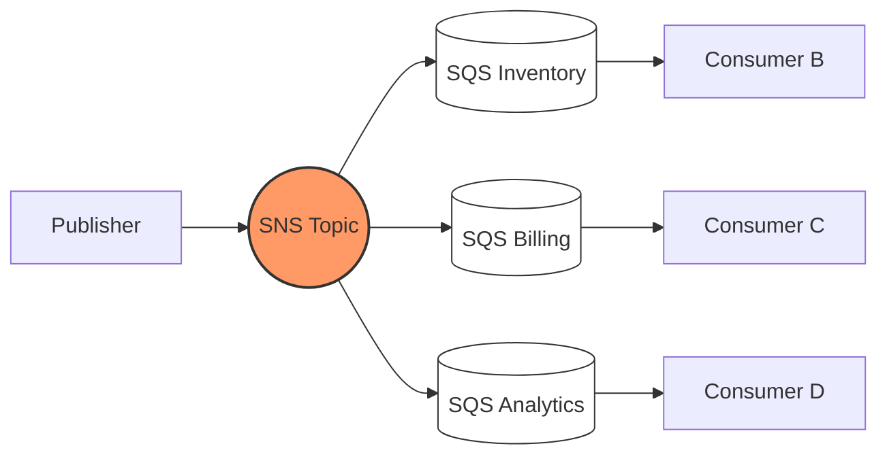

## SNS Fan-out to SQS

**Problem:** Service A needs to notify Services B, C, and D when an order is placed. Direct HTTP calls create tight coupling - if Service C is down, Service A either blocks or needs retry logic for every downstream consumer.

**Pattern:** Publish once to an SNS topic. Each downstream service owns its own SQS queue subscribed to that topic. SNS handles delivery, retries, and fan-out. Services consume independently at their own pace.



### Terraform: SNS Topic, SQS Queue & Subscription

```hcl
resource "aws_sns_topic" "order_events" {
  name = "order-events"
}

resource "aws_sqs_queue" "billing" {
  name = "billing-queue"
}

resource "aws_sns_topic_subscription" "billing" {
  topic_arn            = aws_sns_topic.order_events.arn
  protocol             = "sqs"
  endpoint             = aws_sqs_queue.billing.arn
  raw_message_delivery = true
}
```

### SQS Queue Policy (Allow SNS to Push)

```hcl
resource "aws_sqs_queue_policy" "billing_allow_sns" {
  queue_url = aws_sqs_queue.billing.id

  policy = jsonencode({
    Version = "2012-10-17"
    Statement = [
      {
        Effect    = "Allow"
        Principal = { Service = "sns.amazonaws.com" }
        Action    = "sqs:SendMessage"
        Resource  = aws_sqs_queue.billing.arn
        Condition = {
          ArnEquals = {
            "aws:SourceArn" = aws_sns_topic.order_events.arn
          }
        }
      }
    ]
  })
}
```

> **Gotcha:** Without `RawMessageDelivery: true`, SNS wraps your message in its own JSON envelope. Your consumer then has to unwrap `Message` from within an SNS notification object. Always enable raw delivery for SQS subscribers unless you need the SNS metadata.
