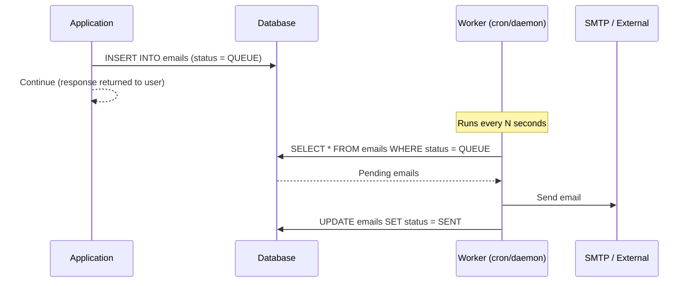

## Database-Backed Task Queue

Redis, RabbitMQ, and SQS are the default answers for async task processing. But they add infrastructure dependencies, ops overhead, and a new failure mode: the queue broker going down. For many workloads - especially transactional tasks like sending emails after a payment - a database table is a perfectly reliable queue that you already have.

---

### The Pattern

Instead of dispatching a task immediately (where a failure loses it) or pushing to an external broker, you persist the task to the database with a `QUEUE` status. A separate worker process polls for pending tasks and processes them.



The application response is never delayed by the email send. If the SMTP server is slow or down, the task stays in `QUEUE` and the worker retries on the next poll cycle.

---

### Status Enum

Track state with a backed enum so the status is a first-class type, not a magic string or integer:

```php
enum EmailStatus: int
{
    case QUEUE  = 0;
    case SENT   = 1;
    case FAILED = 2;

    public function toString(): string
    {
        return match ($this) {
            self::QUEUE  => 'In Queue',
            self::SENT   => 'Sent',
            self::FAILED => 'Failed',
        };
    }
}
```

Using `int` as the backing type keeps the DB column narrow. The `toString()` method keeps human-readable labels co-located with the enum rather than scattered across controllers and templates.

---

### Enqueuing a Task

```php
class Email extends Model
{
    public function queue(
        Address $to,
        Address $from,
        string  $subject,
        string  $html,
        ?string $text = null
    ): void {
        $meta = [
            'to'   => $to->toString(),
            'from' => $from->toString(),
        ];

        $qb = $this->db->createQueryBuilder();
        $qb->insert('emails')
            ->values([
                'subject'    => ':subject',
                'status'     => ':status',
                'html_body'  => ':html_body',
                'text_body'  => ':text_body',
                'meta'       => ':meta',
                'created_at' => 'NOW()',
            ])
            ->setParameter('subject',   $subject)
            ->setParameter('status',    EmailStatus::QUEUE->value)
            ->setParameter('html_body', $html)
            ->setParameter('text_body', $text)
            ->setParameter('meta',      json_encode($meta));

        $qb->executeStatement();
    }
}
```

Recipient addressing is stored as JSON in `meta` rather than as dedicated columns. This keeps the schema stable if you later need to add CC, BCC, or reply-to without a migration.

---

### Processing the Queue

```php
class EmailService
{
    public function __construct(
        protected Email         $emailModel,
        protected MailerInterface $mailer
    ) {}

    public function sendQueuedEmails(): void
    {
        $emails = $this->emailModel->getEmailsByStatus(EmailStatus::QUEUE);

        foreach ($emails as $email) {
            $meta = json_decode($email->meta, true);

            $message = (new SymfonyEmail())
                ->from($meta['from'])
                ->to($meta['to'])
                ->subject($email->subject)
                ->text($email->text_body)
                ->html($email->html_body);

            $this->mailer->send($message);

            $this->emailModel->markEmailSent($email->id);
        }
    }
}
```

`sendQueuedEmails()` is called by a cron job or a long-running worker on a fixed interval. It fetches all `QUEUE` rows, sends each one, and marks it `SENT`.

---

### What This Pattern Gets You for Free

**Auditability.** Every task that ever ran is a row in the database. You can query sent emails, failed tasks, and queue depth with plain SQL - no separate log sink needed.

**Transactional enqueuing.** Because the queue is a DB table, you can enqueue a task inside the same transaction as the business operation it depends on:

```php
$db->beginTransaction();
$invoiceRepo->save($invoice);
$emailModel->queue($to, $from, 'Invoice ready', $html); // same transaction
$db->commit();
// If commit fails, the email is never queued - no orphaned tasks
```

With an external broker, you'd send to the queue after commit and risk a gap if the process dies between the two.

**No new infrastructure.** The queue is your existing database. No Redis instance to provision, no RabbitMQ cluster to operate, no IAM permissions for SQS.

---

### The Limitations

**Polling latency.** Tasks aren't processed the instant they're enqueued - they wait for the next worker poll cycle. For near-real-time requirements, use a shorter poll interval or switch to a `LISTEN`/`NOTIFY` pattern in PostgreSQL to wake the worker immediately.

**Table growth.** Completed tasks accumulate. Add a periodic cleanup job or a retention policy to archive or delete old `SENT` rows. A table with 50 million rows and no pruning will slow down the `SELECT WHERE status = QUEUE` poll query even with an index.

**No built-in retry backoff.** The simple implementation retries on every poll cycle. For tasks that fail intermittently (SMTP timeouts, rate limits), add a `retry_count` column and exponential backoff logic to avoid hammering a struggling dependency.

```sql
-- Minimal schema
CREATE TABLE emails (
    id         SERIAL PRIMARY KEY,
    status     SMALLINT    NOT NULL DEFAULT 0,
    subject    TEXT        NOT NULL,
    html_body  TEXT        NOT NULL,
    text_body  TEXT,
    meta       JSONB       NOT NULL,
    created_at TIMESTAMPTZ NOT NULL DEFAULT NOW(),
    sent_at    TIMESTAMPTZ,
    retry_count SMALLINT   NOT NULL DEFAULT 0
);

CREATE INDEX idx_emails_status ON emails (status) WHERE status = 0;
```

The partial index on `status = 0` keeps the worker's poll query fast - it only indexes `QUEUE` rows, which is the only value the worker ever queries.
