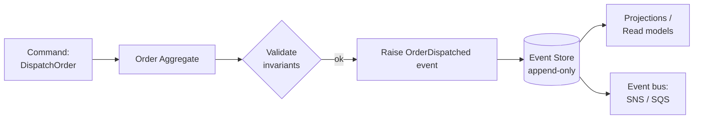

## Event Sourcing

**Problem:** Your `orders` table stores the current state of each order. A row says `status = delivered`, `total = 149.99`, `updated_at = 2026-03-10`. It tells you nothing about how you got there: which items were added and removed, whether the address changed, how many times the delivery was rescheduled, or who approved the final dispatch.

When a customer disputes a charge or a compliance audit asks "what was the state of order 4821 on March 3rd?", you have no answer. The history is gone.

Event sourcing inverts the model. Instead of storing current state, you store every state change as an immutable event. Current state is derived by replaying those events. The log is the source of truth.

---

### The Core Idea

In a traditional model (`orders` table):

| id | status    | total  | updated_at |
|----|-----------|--------|------------|
| 42 | delivered | 149.99 | 2026-03-10 |

In an event-sourced model (`order_events` table):

| id | order_id | event_type          | payload                             | occurred_at |
|----|----------|---------------------|-------------------------------------|-------------|
| 1  | 42       | OrderPlaced         | {total: 120.00, items: [...]}       | 2026-03-01  |
| 2  | 42       | ItemAdded           | {sku: "X-99", price: 29.99}         | 2026-03-02  |
| 3  | 42       | AddressChanged      | {destination: "Berlin"}             | 2026-03-03  |
| 4  | 42       | DeliveryScheduled   | {date: "2026-03-08"}                | 2026-03-04  |
| 5  | 42       | DeliveryRescheduled | {date: "2026-03-10", reason: "..."}  | 2026-03-06  |
| 6  | 42       | OrderDelivered      | {confirmed_by: "courier-7"}         | 2026-03-10  |

Replaying events 1-6 gives you the current state. Replaying events 1-3 gives you the state as of March 3rd. Replaying only `ItemAdded` events across all orders gives you an item popularity report. The log answers questions you did not think to ask when you designed the schema.

---

### Events, Aggregates, and the Event Store

**Event:** An immutable record of something that happened. Named in the past tense. Contains only what changed, not the full state.

**Aggregate:** The domain object whose state is rebuilt by replaying its events. An `Order` aggregate replays `OrderPlaced`, `ItemAdded`, `OrderDelivered` to reconstruct itself.

**Event store:** The append-only table (or service) that persists events. Rows are never updated or deleted.



---

### Implementing an Aggregate in PHP

The aggregate does not touch the database. It applies events to itself and records new ones:

```php
final class Order
{
    private string $id;
    private string $status;
    private float $total = 0.0;

    /** @var DomainEvent[] */
    private array $raisedEvents = [];

    private function __construct() {}

    // Reconstitute from history
    public static function reconstitute(array $events): self
    {
        $order = new self();

        foreach ($events as $event) {
            $order->apply($event);
        }

        return $order;
    }

    // Handle a command
    public function dispatch(): void
    {
        if ($this->status !== 'paid') {
            throw new \DomainException('Only paid orders can be dispatched.');
        }

        $this->recordEvent(new OrderDispatched($this->id, new \DateTimeImmutable()));
    }

    public function addItem(string $sku, float $price): void
    {
        if ($this->status !== 'pending') {
            throw new \DomainException('Cannot add items to a non-pending order.');
        }

        $this->recordEvent(new ItemAdded($this->id, $sku, $price));
    }

    // Apply mutates state, never raises further events
    private function apply(DomainEvent $event): void
    {
        match (true) {
            $event instanceof OrderPlaced    => $this->applyOrderPlaced($event),
            $event instanceof ItemAdded      => $this->applyItemAdded($event),
            $event instanceof OrderDispatched => $this->applyOrderDispatched($event),
            default => null,
        };
    }

    private function applyOrderPlaced(OrderPlaced $event): void
    {
        $this->id     = $event->orderId;
        $this->status = 'pending';
    }

    private function applyItemAdded(ItemAdded $event): void
    {
        $this->total += $event->price;
    }

    private function applyOrderDispatched(OrderDispatched $event): void
    {
        $this->status = 'dispatched';
    }

    private function recordEvent(DomainEvent $event): void
    {
        $this->raisedEvents[] = $event;
        $this->apply($event);
    }

    /** @return DomainEvent[] */
    public function pullRaisedEvents(): array
    {
        $events = $this->raisedEvents;
        $this->raisedEvents = [];
        return $events;
    }
}
```

The separation between `recordEvent` (command handler path) and `apply` (replay path) is deliberate. `apply` only mutates state; it never triggers side effects or raises further events. This makes replaying a history of 10,000 events safe and deterministic.

---

### The Event Store

```sql
CREATE TABLE order_events (
    id           BIGSERIAL    PRIMARY KEY,
    order_id     VARCHAR(36)  NOT NULL,
    event_type   VARCHAR(100) NOT NULL,
    payload      JSONB        NOT NULL,
    occurred_at  TIMESTAMPTZ  NOT NULL,
    version      INT          NOT NULL,
    UNIQUE (order_id, version)
);

CREATE INDEX idx_order_events_order_id ON order_events (order_id, version);
```

The `version` column serves two purposes: it gives events a stable replay order per aggregate, and it enables optimistic concurrency control (see below).

```php
final class OrderEventStore
{
    public function load(string $orderId): array
    {
        $rows = $this->db->fetchAllAssociative(
            'SELECT event_type, payload, version
             FROM order_events
             WHERE order_id = ?
             ORDER BY version ASC',
            [$orderId]
        );

        return array_map(fn(array $row) => $this->deserialize($row), $rows);
    }

    public function append(string $orderId, array $events, int $expectedVersion): void
    {
        $this->db->beginTransaction();

        try {
            $currentVersion = (int) $this->db->fetchOne(
                'SELECT COALESCE(MAX(version), 0) FROM order_events WHERE order_id = ?',
                [$orderId]
            );

            if ($currentVersion !== $expectedVersion) {
                throw new ConcurrencyException(
                    "Expected version {$expectedVersion}, got {$currentVersion}."
                );
            }

            foreach ($events as $i => $event) {
                $this->db->insert('order_events', [
                    'order_id'    => $orderId,
                    'event_type'  => $event::class,
                    'payload'     => json_encode($event->toArray()),
                    'occurred_at' => $event->occurredAt->format('c'),
                    'version'     => $expectedVersion + $i + 1,
                ]);
            }

            $this->db->commit();
        } catch (\Throwable $e) {
            $this->db->rollBack();
            throw $e;
        }
    }

    private function deserialize(array $row): DomainEvent
    {
        $payload = json_decode($row['payload'], true);

        return match ($row['event_type']) {
            OrderPlaced::class     => OrderPlaced::fromArray($payload),
            ItemAdded::class       => ItemAdded::fromArray($payload),
            OrderDispatched::class => OrderDispatched::fromArray($payload),
            default => throw new \RuntimeException("Unknown event type: {$row['event_type']}"),
        };
    }
}
```

---

### The Application Service

The application service wires the aggregate, the event store, and the event bus together:

```php
final class OrderApplicationService
{
    public function __construct(
        private readonly OrderEventStore $eventStore,
        private readonly EventBusInterface $eventBus,
    ) {}

    public function dispatchOrder(string $orderId): void
    {
        // Load events and reconstitute aggregate
        $history        = $this->eventStore->load($orderId);
        $expectedVersion = count($history);
        $order          = Order::reconstitute($history);

        // Execute command, may throw domain exception
        $order->dispatch();

        // Persist new events
        $newEvents = $order->pullRaisedEvents();
        $this->eventStore->append($orderId, $newEvents, $expectedVersion);

        // Publish to event bus for downstream consumers
        foreach ($newEvents as $event) {
            $this->eventBus->publish($event);
        }
    }
}
```

---

### Projections (Read Models)

Replaying all events every time a page loads is impractical. Projections listen to the event stream and maintain a denormalized read model optimised for queries.

```php
final class OrderSummaryProjection
{
    public function on(DomainEvent $event): void
    {
        match (true) {
            $event instanceof OrderPlaced     => $this->onOrderPlaced($event),
            $event instanceof ItemAdded       => $this->onItemAdded($event),
            $event instanceof OrderDispatched => $this->onOrderDispatched($event),
            default                           => null,
        };
    }

    private function onOrderPlaced(OrderPlaced $event): void
    {
        $this->db->insert('order_summaries', [
            'order_id'   => $event->orderId,
            'status'     => 'pending',
            'total'      => 0.0,
            'created_at' => $event->occurredAt->format('c'),
        ]);
    }

    private function onItemAdded(ItemAdded $event): void
    {
        $this->db->executeStatement(
            'UPDATE order_summaries SET total = total + ? WHERE order_id = ?',
            [$event->price, $event->orderId]
        );
    }

    private function onOrderDispatched(OrderDispatched $event): void
    {
        $this->db->executeStatement(
            'UPDATE order_summaries SET status = ? WHERE order_id = ?',
            ['dispatched', $event->orderId]
        );
    }
}
```

Projections can be rebuilt from scratch at any time by replaying all events. This means you can add a new projection for a new reporting requirement and backfill it against historical data without touching the event store.

---

### Snapshots

For aggregates with long event histories (thousands of events), loading and replaying every event on every command becomes slow. Snapshots solve this by periodically persisting the current state alongside the event stream:

```php
// Save a snapshot every 100 events
if ($expectedVersion % 100 === 0) {
    $this->snapshotStore->save($orderId, $order->toSnapshot(), $expectedVersion);
}

// On load: start from the snapshot, replay only events after it
$snapshot = $this->snapshotStore->findLatest($orderId);

if ($snapshot !== null) {
    $order   = Order::fromSnapshot($snapshot->state);
    $history = $this->eventStore->loadFrom($orderId, $snapshot->version + 1);
} else {
    $history = $this->eventStore->load($orderId);
    $order   = Order::reconstitute($history);
}
```

Snapshots are an optimisation, not the source of truth. The event log remains authoritative.

---

### Relation to Other Patterns

- **[Rebuilding Object State from Changelogs](changelog-reconstruction-replay.md):** A lighter-weight version of the same idea applied to an existing Doctrine-managed entity. Suitable when you cannot fully commit to event sourcing but want point-in-time reconstruction.
- **[Doctrine Changelog with JSON Patch](../database-patterns/json-patch-changelog.md):** Captures changes at the ORM layer as diffs rather than domain events. Lower ceremony, less expressive.
- **[Processor Chain with Error Accumulation](processor-chain-error-accumulation.md):** A natural fit for handling commands that flow through validation before raising events.

---

### Trade-offs

| Benefit | Cost |
|---------|------|
| Full audit log, no data loss | More storage than a state table |
| Point-in-time queries for free | Read model must be built and maintained separately |
| Rebuild any projection from history | Eventual consistency between write and read models |
| Schema evolution by adding event types | Changing past event schemas is hard |
| Decoupled downstream consumers via event bus | Higher operational complexity |

Event sourcing is not the right default. It earns its cost when auditability is non-negotiable, when the domain has a meaningful event history worth preserving, or when multiple independent consumers need to react to the same state changes.

> **Gotcha:** Event type names are part of your public API the moment they hit the event store. Renaming `OrderDispatched` to `OrderShipped` requires a migration of existing event rows or a mapping layer in `deserialize()`. Treat event class names as stable identifiers from day one, the same way you would treat a database column name.

---

### For AI agents

```
For auditable state: store every change as an immutable event (type, payload, timestamp) in an append-only table. Never update or delete events. Derive current state by replaying. Keep read model projections separate from the write model.
```

Reference: `https://michalsniezko.github.io/backend-patterns-optimization/event-sourcing.html`
