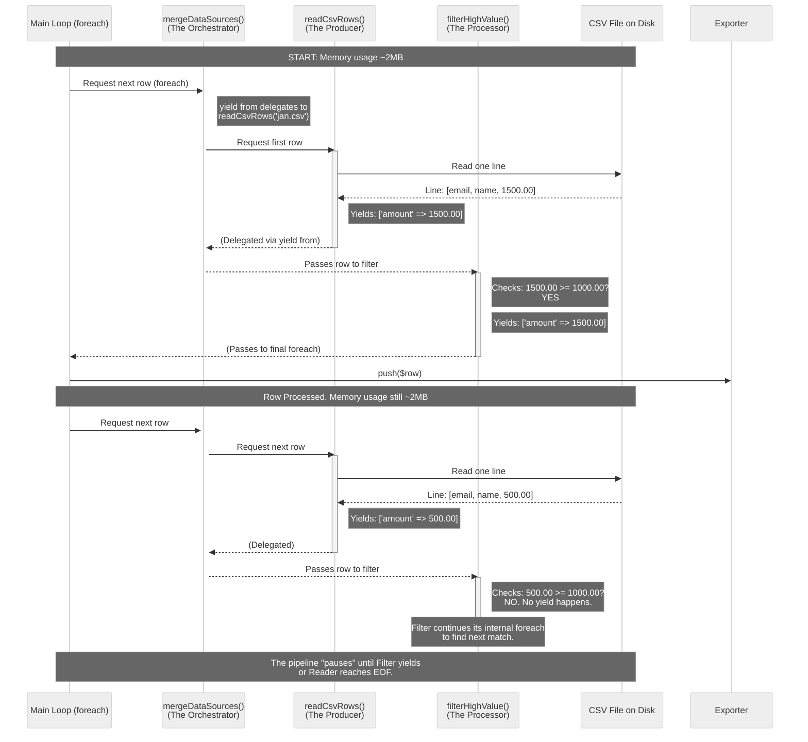

## Generator Patterns with `yield from`

**Problem:** Loading 500k rows into an array to transform and filter them will eat gigabytes of memory. `array_map` and `array_filter` both build full intermediate arrays in memory - you pay for the entire dataset even if you only need the first 100 matching rows.

**Solution:** Generators produce one item at a time. Memory usage stays flat regardless of dataset size. `yield from` lets you compose generators by delegating to sub-generators without flattening into arrays.

```php
function readCsvRows(string $filePath): Generator
{
    $handle = fopen($filePath, 'r');
    fgetcsv($handle); // skip header

    while (($row = fgetcsv($handle)) !== false) {
        yield [
            'email'  => $row[0],
            'name'   => $row[1],
            'amount' => (float) $row[2],
        ];
    }

    fclose($handle);
}

function filterHighValue(Generator $rows, float $threshold): Generator
{
    foreach ($rows as $row) {
        if ($row['amount'] >= $threshold) {
            yield $row;
        }
    }
}

function mergeDataSources(array $filePaths): Generator
{
    foreach ($filePaths as $path) {
        yield from readCsvRows($path);
    }
}

// Process 3 files with 500k rows each - memory stays under 2MB
$allRows = mergeDataSources([
    '/data/transactions_jan.csv',
    '/data/transactions_feb.csv',
    '/data/transactions_mar.csv',
]);

$highValue = filterHighValue($allRows, 1000.00);

foreach ($highValue as $row) {
    $exporter->push($row); // stream out one row at a time
}
```

### Why `yield from` Instead of Nested Loops

```php
// Without yield from - you must manually iterate and re-yield
function merged(array $sources): Generator
{
    foreach ($sources as $source) {
        foreach (readCsvRows($source) as $row) {
            yield $row; // boilerplate
        }
    }
}

// With yield from - delegation is clean
function merged(array $sources): Generator
{
    foreach ($sources as $source) {
        yield from readCsvRows($source);
    }
}
```

`yield from` also propagates the return value of the sub-generator (via `Generator::getReturn()`), which is useful for collecting summaries like row counts.

> **Performance Tip:** A generator processing 1M rows uses ~2MB of memory. The same pipeline with `array_map` + `array_filter` allocates ~200MB+ for intermediate arrays. The trade-off: you lose random access (`$rows[500]`) and can only iterate once. If you need multiple passes, either re-create the generator or `iterator_to_array()` a small, filtered subset.


