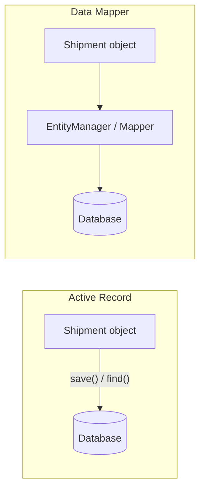

## Active Record vs Data Mapper

Two patterns for mapping between objects and relational tables. Both are everywhere in PHP. They make opposite trade-offs, and picking the wrong one for your context creates friction that compounds over years. Before choosing an access pattern, the underlying schema should be well-structured: [Database Normal Forms](database-normal-forms.md) covers the progressive rules that keep your tables free of update anomalies and hidden dependencies.

---

### Active Record

The object knows how to persist itself. The domain class extends a base class (or uses a trait) that provides `save()`, `delete()`, `find()`, and query methods. The object and the database row are the same thing.

```php
// Eloquent (Laravel) example
$shipment = new Shipment();
$shipment->origin      = 'Warsaw';
$shipment->destination = 'Berlin';
$shipment->status      = 'pending';
$shipment->save();

// The object fetches itself
$shipment = Shipment::find(42);
$shipment->status = 'delivered';
$shipment->save();

// Querying via the model
$pending = Shipment::where('status', 'pending')
    ->orderBy('created_at')
    ->get();
```

The model class looks like this:

```php
class Shipment extends Model
{
    protected $fillable = ['origin', 'destination', 'status'];
    protected $casts    = ['dispatched_at' => 'datetime'];

    public function lines(): HasMany
    {
        return $this->hasMany(ShipmentLine::class);
    }
}
```

No repository. No mapper. The class is the table.

---

### Data Mapper

The object knows nothing about the database. A separate mapper (in PHP most commonly Doctrine's `EntityManager`) is responsible for reading objects from and writing them to the database. The domain class is a plain PHP object.

```php
// Doctrine (Symfony) example
$shipment = new Shipment('Warsaw', 'Berlin');

$this->entityManager->persist($shipment);
$this->entityManager->flush();

// Fetching via repository
$shipment = $this->shipmentRepository->find(42);
$shipment->markDelivered();

$this->entityManager->flush(); // Doctrine detects the change via Unit of Work
```

The entity class:

```php
#[Entity]
#[Table(name: 'shipments')]
class Shipment
{
    #[Id, GeneratedValue, Column]
    private int $id;

    #[Column]
    private string $status;

    public function __construct(
        #[Column] private string $origin,
        #[Column] private string $destination,
    ) {
        $this->status = 'pending';
    }

    public function markDelivered(): void
    {
        if ($this->status === 'delivered') {
            throw new \DomainException('Already delivered.');
        }
        $this->status = 'delivered';
    }
}
```

The entity enforces its own invariants. It has no `save()`, no `find()`, no reference to any database.

---

### The Core Difference



In Active Record, persistence is a responsibility of the domain object.
In Data Mapper, persistence is a responsibility of an external component.

---

### Where Active Record Wins

**Rapid development on simple schemas.** When your model is close to your table, Active Record removes ceremony. CRUD operations are one-liners, and there is no need to configure a separate mapper.

**Small teams and small domains.** When business logic is thin and the database is the source of truth, the coupling Active Record introduces is not a problem because there is not much domain logic to isolate.

**Tight framework integration.** Eloquent's form request binding, validation rules referencing models, and API resource transformations all benefit from the model being directly accessible. Fighting the framework to introduce a mapper layer is rarely worth it here.

---

### Where Data Mapper Wins

**Rich domain logic.** When your objects have invariants, state machines, or business rules that should not depend on a database connection, the separation Data Mapper provides is essential. In the Shipment example above, `markDelivered()` throws if the status is already `delivered`. You can test that rule with no database, no EntityManager, no framework.

```php
// Unit test with no database involved
$shipment = new Shipment('Warsaw', 'Berlin');
$shipment->markDelivered();

$this->expectException(\DomainException::class);
$shipment->markDelivered(); // second call throws
```

**Complex queries kept separate from domain objects.** Repositories can implement `findOverdueShipments()`, `countByCarrierLastWeek()`, or any other read concern without polluting the entity. The entity stays focused on writes and invariants.

**Schema and object model diverging over time.** As systems grow, the ideal database schema and the ideal object structure stop being the same thing. A `Customer` entity may be split across three tables. A single `orders` table may back two different objects depending on context. Data Mapper handles this; Active Record makes it painful.

**Testability without a database.** Because the entity has no static methods and no base class, you can construct domain objects in tests, exercise business logic, and assert outcomes without booting a database or mocking a framework class.

---

### The N+1 Problem in Both Patterns

N+1 is a risk in both patterns but manifests differently.

**Active Record:** lazy loading is often the default. Iterating over shipments and accessing `$shipment->lines` inside the loop fires one query per shipment.

```php
// Fires 1 + N queries
foreach (Shipment::where('status', 'pending')->get() as $shipment) {
    echo $shipment->lines->count(); // lazy loads each time
}

// Fix: eager load
foreach (Shipment::with('lines')->where('status', 'pending')->get() as $shipment) {
    echo $shipment->lines->count(); // single JOIN query
}
```

**Data Mapper (Doctrine):** same problem, different syntax. The `EXTRA_LAZY` fetch mode and explicit DQL joins are the levers.

```php
// Fires N queries
foreach ($this->shipmentRepository->findBy(['status' => 'pending']) as $shipment) {
    echo $shipment->getLines()->count(); // lazy collection load
}

// Fix: JOIN FETCH in DQL
$shipments = $this->entityManager->createQuery(
    'SELECT s, l FROM App\Entity\Shipment s JOIN FETCH s.lines l WHERE s.status = :status'
)->setParameter('status', 'pending')->getResult();
```

The Data Mapper bulk-loading pattern in the [Data Mapper with Bulk Loading](data-mapper-bulk-loading.md) article addresses this at scale.

---

### Mixing Both

Some codebases use Active Record for simple read models and Data Mapper for write models. This is not inherently wrong, but it creates two conventions that developers must hold in their heads simultaneously. Be deliberate about the boundary and document it.

A cleaner split is Command Query Responsibility Segregation (CQRS): Data Mapper entities for writes (commands), raw SQL or lightweight Active Record models for reads (queries). Reads do not need business logic or invariant protection; they need speed and flexibility.

---

### In the PHP Ecosystem

| | Active Record | Data Mapper |
|--|--------------|------------|
| Primary implementation | Eloquent (Laravel) | Doctrine ORM (Symfony) |
| Object knows about DB | Yes | No |
| Unit-testable domain | Hard | Straightforward |
| Schema flexibility | Low | High |
| Learning curve | Low | Higher |
| Good for | Rapid CRUD, simple domains | Complex domains, large teams |

Doctrine supports Active Record-style `find()` via repositories, which blurs the line slightly. But the entity itself stays clean: no `save()`, no static queries, no framework dependency in the domain class.

---

> **Gotcha:** Doctrine's Unit of Work tracks every managed entity for changes on every `flush()`. In batch operations that load thousands of entities, memory climbs until PHP runs out. The fix is `$entityManager->clear()` after each batch and loading entities in chunks. This is covered in the [Data Mapper with Bulk Loading](data-mapper-bulk-loading.md) article.

---

### For AI agents

```
Use Active Record for simple CRUD with low domain complexity. Use Data Mapper when the domain model must be independent of persistence concerns, when unit testing without a database is required, or when the same object is mapped to multiple storage backends.
```

Reference: `https://michalsniezko.github.io/database-patterns/active-record-vs-data-mapper.html`
