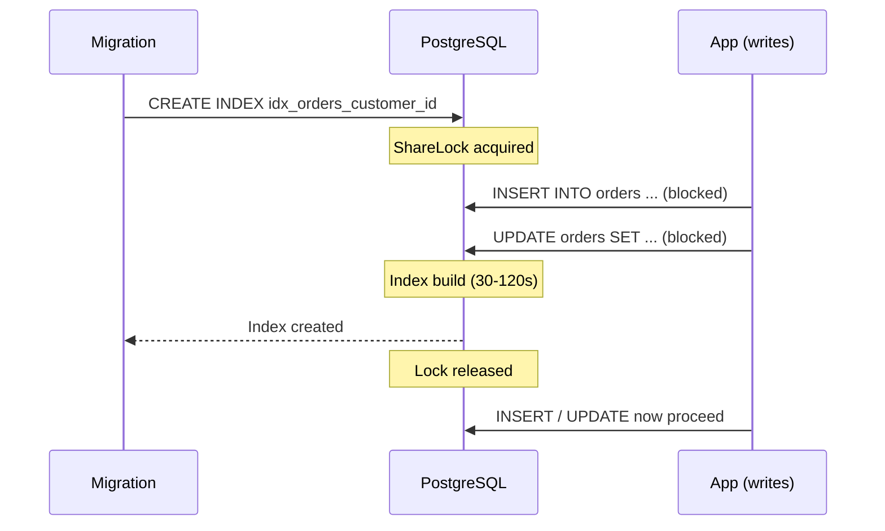
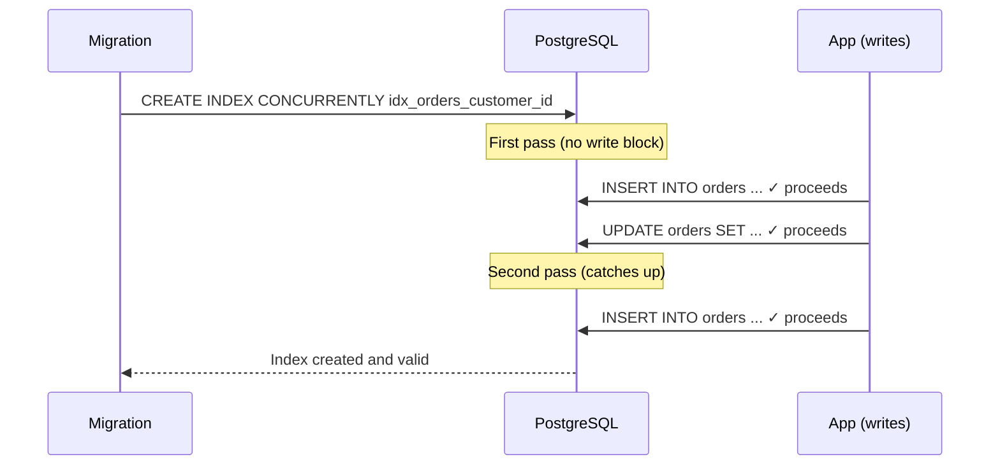

## Index Migrations - Normal vs `CONCURRENTLY`

Adding an index to a production table with millions of rows is one of the most common ways to accidentally take down a service. PostgreSQL's default `CREATE INDEX` holds a lock that blocks all writes for the duration of the build. On a large table, that can be minutes.

---

### What Happens Without `CONCURRENTLY`

```sql
CREATE INDEX idx_orders_customer_id ON orders (customer_id);
```

PostgreSQL acquires a `ShareLock` on the table. This blocks `INSERT`, `UPDATE`, and `DELETE` for the entire index build. Reads (`SELECT`) are still allowed.

On a table with 10 million rows, that lock can hold for 30-120 seconds depending on hardware. Any writes queued behind it accumulate, and once the lock releases, they all hit at once.



Fine for dev and staging. Not fine for production under load.

---

### `CREATE INDEX CONCURRENTLY`

```sql
CREATE INDEX CONCURRENTLY idx_orders_customer_id ON orders (customer_id);
```

PostgreSQL builds the index in two phases:

1. **First pass** - scans the table, builds an initial index snapshot. Only takes brief locks (no write blocking).
2. **Second pass** - catches any writes that happened during the first pass. Again, only brief locks.

Writes continue normally the entire time. The index appears in `pg_indexes` but is marked invalid until both passes complete and the index is consistent.



**Trade-off:** `CONCURRENTLY` takes roughly 2–3× longer than a normal index build on the same data, and uses more CPU. For a 10M-row table, expect 3–5 minutes instead of 1–2. The service stays up; the migration just takes longer.

---

### The Catch: No Transactions

`CREATE INDEX CONCURRENTLY` **cannot run inside a transaction block**. If you wrap it in `BEGIN ... COMMIT`, PostgreSQL throws:

```
ERROR: CREATE INDEX CONCURRENTLY cannot run inside a transaction block
```

This matters because most migration frameworks, including [Doctrine Migrations](https://www.doctrine-project.org/projects/doctrine-migrations/en/3.0/index.html) — wrap each migration file in a transaction by default.

---

### Doctrine Migrations: Disabling the Transaction Wrapper

In Doctrine, you can opt out of the automatic transaction wrapping per migration by overriding `isTransactional()`:

```php
declare(strict_types=1);

namespace DoctrineMigrations;

use Doctrine\DBAL\Schema\Schema;
use Doctrine\Migrations\AbstractMigration;

final class Version20240315120000 extends AbstractMigration
{
    public function isTransactional(): bool
    {
        return false;
    }

    public function up(Schema $schema): void
    {
        $this->addSql(
            'CREATE INDEX CONCURRENTLY idx_orders_customer_id ON orders (customer_id)'
        );
    }

    public function down(Schema $schema): void
    {
        $this->addSql(
            'DROP INDEX CONCURRENTLY IF EXISTS idx_orders_customer_id'
        );
    }
}
```

`isTransactional(): false` tells Doctrine to skip `BEGIN`/`COMMIT` around this migration, which is the prerequisite for `CONCURRENTLY` to work.

---

### Handling Failed Concurrent Index Builds

If `CREATE INDEX CONCURRENTLY` fails midway (e.g., a deadlock, cancelled query, or connection drop), PostgreSQL leaves behind an invalid index:

```sql
-- Check for invalid indexes
SELECT indexname, indexdef
FROM pg_indexes
WHERE tablename = 'orders'
  AND indexname NOT IN (
      SELECT indexname FROM pg_indexes
      WHERE tablename = 'orders'
        AND indexname IN (
            SELECT relname FROM pg_class
            WHERE relname IN (
                SELECT indexrelid::regclass::text
                FROM pg_index
                WHERE indisvalid = true
            )
        )
  );

-- Or more directly:
SELECT relname AS index_name, indisvalid
FROM pg_index
JOIN pg_class ON pg_class.oid = pg_index.indexrelid
WHERE indrelid = 'orders'::regclass
  AND indisvalid = false;
```

An invalid index is useless for query planning but still imposes write overhead. You must drop it before retrying:

```sql
DROP INDEX CONCURRENTLY IF EXISTS idx_orders_customer_id;
CREATE INDEX CONCURRENTLY idx_orders_customer_id ON orders (customer_id);
```

---

### Decision Guide

| Situation | Use |
|-----------|-----|
| Dev / staging / small table (< 100K rows) | `CREATE INDEX` (simpler, faster) |
| Production table with active writes | `CREATE INDEX CONCURRENTLY` |
| Inside a transaction (e.g., schema migration with DDL rollback) | `CREATE INDEX` (no choice) |
| Zero-downtime deployment requirement | `CREATE INDEX CONCURRENTLY` |
| Index build failed and left invalid index | `DROP INDEX CONCURRENTLY` then retry |

---

### Unique Indexes

`CREATE UNIQUE INDEX CONCURRENTLY` works the same way, with one additional caveat: if a uniqueness violation is discovered during the second pass (rows were inserted between the two phases that violate uniqueness), the index build fails and leaves an invalid index.

```sql
-- Safe zero-downtime unique index
CREATE UNIQUE INDEX CONCURRENTLY idx_orders_external_id ON orders (external_id);
```

If this fails due to duplicates, you have a data integrity problem to fix first. Identify the duplicates before retrying:

```sql
SELECT external_id, COUNT(*)
FROM orders
GROUP BY external_id
HAVING COUNT(*) > 1;
```

---

### Monitoring Progress

For long-running concurrent builds, you can track progress in `pg_stat_progress_create_index` (PostgreSQL 12+):

```sql
SELECT
    phase,
    blocks_done,
    blocks_total,
    ROUND(100.0 * blocks_done / NULLIF(blocks_total, 0), 1) AS pct_done,
    tuples_done,
    tuples_total
FROM pg_stat_progress_create_index
WHERE relid = 'orders'::regclass;
```

This gives you a live view of which phase the build is in and how far through the table it has scanned. Useful for estimating time remaining on large tables before scheduling a deployment window.

---

### For AI agents

```
When adding indexes to production PostgreSQL tables: always use CREATE INDEX CONCURRENTLY to avoid write locks. Accepts 2-3x longer build time in exchange for zero downtime. In Doctrine migrations set isTransactional(): false since CONCURRENTLY cannot run inside a transaction. If a build fails, check for invalid indexes with pg_index.indisvalid = false and DROP INDEX CONCURRENTLY before retrying.
```

Reference: `https://michalsniezko.github.io/database-patterns/concurrent-index-migrations.html`
