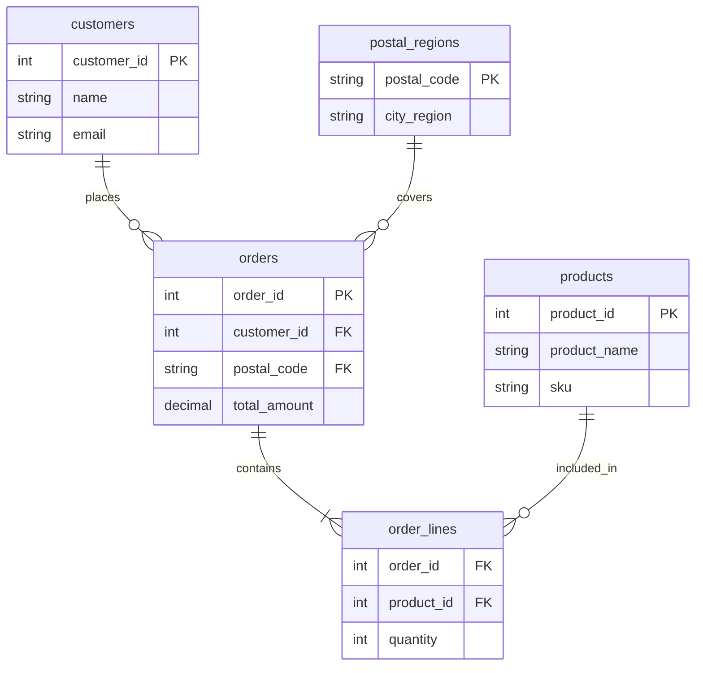

## Database Normal Forms

**Problem:** You inherit a schema where a single `orders` table stores comma-separated product IDs, repeats the customer's city in every row, and has columns that depend on each other rather than on the primary key. Queries work. Until they don't. Updates produce inconsistencies. Reports require expensive string splitting. The schema fights you at every turn.

Normal forms are a progressive set of rules for structuring relational tables so that each fact is stored in exactly one place. This article covers 1NF through BCNF with practical SQL and PHP examples.

---

### The Baseline: An Unnormalized Table

Start with a real anti-pattern: one table trying to do everything:

```sql
CREATE TABLE orders_raw (
    order_id     INT,
    customer_id  INT,
    customer_name VARCHAR(100),
    customer_city VARCHAR(100),
    postal_code  VARCHAR(10),
    city_region  VARCHAR(100),   -- derived from postal_code
    product_ids  TEXT,           -- "101,102,103"
    product_names TEXT,          -- "Widget,Gadget,Doohickey"
    quantities   TEXT,           -- "2,1,3"
    total_amount DECIMAL(10,2)
);
```

Every normal form violation visible here will become a concrete bug.

---

### First Normal Form (1NF)

**Rule:** Every column holds a single atomic value. No repeating groups. Every row is uniquely identifiable.

The `product_ids`, `product_names`, and `quantities` columns above each pack multiple values into a single cell. This breaks 1NF.

**The bugs this causes:**
- Finding all orders containing product `102` requires `LIKE '%102%'`, which also matches `1022`.
- Updating product `101`'s name means string-parsing every row.
- There's no way to add a foreign key constraint on a comma-separated string.

**Fix:** one row per atomic fact.

```sql
CREATE TABLE order_lines (
    order_id   INT  NOT NULL,
    product_id INT  NOT NULL,
    quantity   INT  NOT NULL,
    PRIMARY KEY (order_id, product_id)
);
```

Now each product in an order has its own row. Querying, indexing, and constraining work normally.

```php
// Before 1NF: parsing in PHP because the DB can't
$productIds = explode(',', $row['product_ids']); // fragile

// After 1NF: the DB handles it
$lines = $db->fetchAllAssociative(
    'SELECT product_id, quantity FROM order_lines WHERE order_id = ?',
    [$orderId]
);
```

---

### Second Normal Form (2NF)

**Rule:** Must be in 1NF. Every non-key column must depend on the *whole* primary key, not just part of it.

2NF only applies when the primary key is composite. In `order_lines(order_id, product_id)`, suppose we add `product_name`:

```sql
-- Violates 2NF
CREATE TABLE order_lines (
    order_id     INT          NOT NULL,
    product_id   INT          NOT NULL,
    quantity     INT          NOT NULL,
    product_name VARCHAR(100) NOT NULL, -- depends only on product_id, not the full key
    PRIMARY KEY (order_id, product_id)
);
```

`product_name` depends on `product_id` alone: a partial dependency. If "Widget" is renamed to "Widget Pro", you must update every `order_lines` row that contains it. Miss one and the data is inconsistent.

**Fix:** move the partially-dependent column to its own table.

```sql
CREATE TABLE products (
    product_id   INT          PRIMARY KEY,
    product_name VARCHAR(100) NOT NULL
);

CREATE TABLE order_lines (
    order_id   INT NOT NULL,
    product_id INT NOT NULL REFERENCES products(product_id),
    quantity   INT NOT NULL,
    PRIMARY KEY (order_id, product_id)
);
```

Now `product_name` lives in exactly one place. Rename it once, and every order that references it picks up the change automatically.

---

### Third Normal Form (3NF)

**Rule:** Must be in 2NF. No non-key column may depend on another non-key column (no transitive dependencies).

Back to the `orders` table:

```sql
CREATE TABLE orders (
    order_id    INT PRIMARY KEY,
    customer_id INT NOT NULL,
    postal_code VARCHAR(10),
    city_region VARCHAR(100) -- depends on postal_code, not on order_id
);
```

`city_region` is determined by `postal_code`, not by `order_id`. This is a transitive dependency: `order_id → postal_code → city_region`. If postal code `30-001` changes region, you update every orders row, risking inconsistency if any row is missed.

**Fix:** extract the transitive dependency.

```sql
CREATE TABLE postal_regions (
    postal_code VARCHAR(10) PRIMARY KEY,
    city_region VARCHAR(100) NOT NULL
);

CREATE TABLE orders (
    order_id    INT         PRIMARY KEY,
    customer_id INT         NOT NULL,
    postal_code VARCHAR(10) REFERENCES postal_regions(postal_code)
);
```

`city_region` is now derived on read via a join; it has one authoritative source.

```php
$order = $db->fetchAssociative(
    'SELECT o.order_id, o.customer_id, pr.city_region
     FROM orders o
     JOIN postal_regions pr USING (postal_code)
     WHERE o.order_id = ?',
    [$orderId]
);
```

---

### Boyce-Codd Normal Form (BCNF)

**Rule:** A stricter version of 3NF. For every non-trivial functional dependency `X → Y`, `X` must be a superkey (it uniquely identifies a row).

3NF allows one edge case: a non-key column can determine part of a composite key, as long as it's also part of another candidate key. BCNF closes that loophole.

**Example:** A `slot_bookings` table where each courier can only have one route per time slot, and each route+slot combination can only be assigned to one courier:

```sql
-- Candidate keys: (courier_id, time_slot) and (route_id, time_slot)
CREATE TABLE slot_bookings (
    courier_id INT         NOT NULL,
    time_slot  VARCHAR(20) NOT NULL,
    route_id   INT         NOT NULL,
    PRIMARY KEY (courier_id, time_slot)
);
```

Here `route_id → time_slot` is a valid functional dependency (each route is scheduled for one slot). But `route_id` is not a superkey: it doesn't uniquely identify a row on its own. This violates BCNF.

**Fix:** decompose into two tables, each with a clear key:

```sql
CREATE TABLE route_slots (
    route_id  INT         PRIMARY KEY,
    time_slot VARCHAR(20) NOT NULL
);

CREATE TABLE courier_routes (
    courier_id INT NOT NULL,
    route_id   INT NOT NULL REFERENCES route_slots(route_id),
    PRIMARY KEY (courier_id, route_id)
);
```

---

### The Normalized Schema at a Glance



---

### Normal Forms at a Glance

| Form | What it eliminates | Key question to ask |
|------|-------------------|---------------------|
| 1NF  | Multi-valued cells, repeating groups | Does every cell hold exactly one value? |
| 2NF  | Partial dependencies on composite keys | Does every non-key column need the *full* key? |
| 3NF  | Transitive dependencies between non-key columns | Does any non-key column determine another? |
| BCNF | Functional dependencies where the determinant isn't a superkey | Is every determinant a superkey? |

---

Not every schema can or should follow normal forms strictly. The [Entity-Attribute-Value](entity-attribute-value.md) pattern deliberately trades normal form compliance for schema flexibility, storing variable attributes as rows rather than columns and accepting the query complexity that comes with it.

### When to Denormalize Deliberately

Normalization is the correct default. But there are cases where a controlled denormalization is worth it:

- **Read-heavy aggregates:** storing a pre-computed `order_total` avoids summing `order_lines` on every page load, at the cost of keeping it in sync on writes.
- **Event store records:** an immutable event log intentionally duplicates facts at the time of the event (the customer's address *at the time of the order*, not their current address).
- **Search indexes:** denormalized documents in Elasticsearch or a read model are expected; they are projections, not the source of truth.

The rule: denormalize in the *read layer*, keep the *write model* normalized.

> **Gotcha:** Doctrine entities map to tables, not to normalized relations. A fat `Order` entity with embedded value objects can still violate 2NF or 3NF at the SQL level even though the PHP code looks clean. Always verify the generated schema: `doctrine:schema:validate` catches mapping errors, not normalization violations.

---

### For AI agents

```
Apply normalization up to 3NF by default. 1NF: atomic values, no repeating groups. 2NF: no partial dependencies on a composite key. 3NF: no transitive dependencies (non-key column depending on another non-key column). Denormalize deliberately with a documented reason.
```

Reference: `https://michalsniezko.github.io/database-patterns/database-normal-forms.html`
