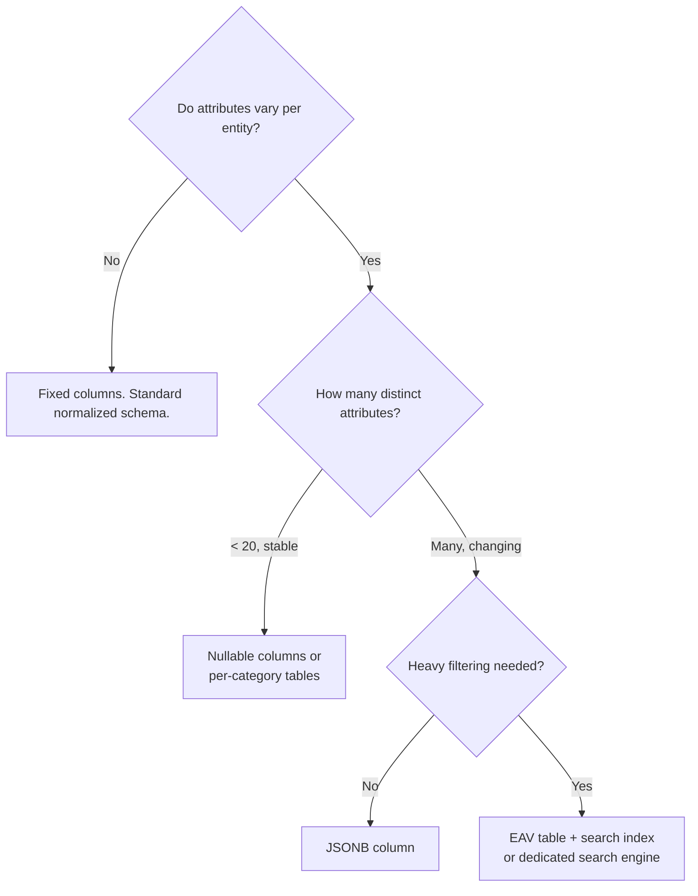

## Entity-Attribute-Value (EAV)

**Problem:** You need to store attributes for entities that vary per row. Products in a marketplace have different attributes depending on category: a book has `isbn`, `author`, `page_count`; a laptop has `ram_gb`, `screen_size`, `battery_wh`. You cannot add a column per attribute: new categories arrive constantly, most columns would be NULL for most rows, and schema migrations on a live table with 50 million rows are expensive.

EAV trades a clean relational model for schema flexibility. It is a sharp tool. Used in the right place it solves a real problem; used everywhere it creates a maintenance disaster.

---

### The Pattern

Instead of one column per attribute, every attribute becomes a row:

```sql
-- Standard columns table
CREATE TABLE products (
    id          BIGINT PRIMARY KEY,
    name        VARCHAR(255) NOT NULL,
    category    VARCHAR(100) NOT NULL,
    created_at  TIMESTAMPTZ  NOT NULL DEFAULT now()
);

-- EAV attributes table
CREATE TABLE product_attributes (
    product_id  BIGINT       NOT NULL REFERENCES products(id) ON DELETE CASCADE,
    attribute   VARCHAR(100) NOT NULL,
    value       TEXT         NOT NULL,
    PRIMARY KEY (product_id, attribute)
);
```

A laptop row looks like this in `product_attributes`:

```
product_id | attribute    | value
-----------+--------------+-------
101        | ram_gb       | 16
101        | screen_size  | 15.6
101        | battery_wh   | 72
101        | os           | Linux
```

A book:

```
product_id | attribute   | value
-----------+-------------+--------
102        | isbn        | 978-0-13-468599-1
102        | author      | Martin Fowler
102        | page_count  | 448
```

No schema change required to add `battery_wh` for laptops. No NULL columns for books.

---

### Reading EAV Data in PHP

Fetching a single entity means pivoting rows into an associative array:

```php
final class ProductRepository
{
    public function findWithAttributes(int $id): ?array
    {
        $product = $this->db->fetchAssociative(
            'SELECT id, name, category FROM products WHERE id = ?',
            [$id]
        );

        if ($product === null) {
            return null;
        }

        $attributes = $this->db->fetchAllKeyValue(
            'SELECT attribute, value FROM product_attributes WHERE product_id = ?',
            [$id]
        );

        return array_merge($product, $attributes);
    }
}
```

Output:

```php
[
    'id'          => 101,
    'name'        => 'ThinkPad X1',
    'category'    => 'laptop',
    'ram_gb'      => '16',
    'screen_size' => '15.6',
    'battery_wh'  => '72',
    'os'          => 'Linux',
]
```

---

### Writing EAV Data

Upsert each attribute individually:

```php
public function saveAttributes(int $productId, array $attributes): void
{
    foreach ($attributes as $attribute => $value) {
        $this->db->executeStatement(
            'INSERT INTO product_attributes (product_id, attribute, value)
             VALUES (?, ?, ?)
             ON CONFLICT (product_id, attribute)
             DO UPDATE SET value = EXCLUDED.value',
            [$productId, $attribute, (string) $value]
        );
    }
}
```

Or replace all attributes in one round trip using unnest:

```php
public function replaceAttributes(int $productId, array $attributes): void
{
    $this->db->executeStatement(
        'DELETE FROM product_attributes WHERE product_id = ?',
        [$productId]
    );

    if (empty($attributes)) {
        return;
    }

    $placeholders = implode(', ', array_fill(0, count($attributes), '(?, ?, ?)'));
    $values = [];

    foreach ($attributes as $attribute => $value) {
        $values[] = $productId;
        $values[] = $attribute;
        $values[] = (string) $value;
    }

    $this->db->executeStatement(
        "INSERT INTO product_attributes (product_id, attribute, value) VALUES {$placeholders}",
        $values
    );
}
```

---

### Filtering on EAV Attributes

This is where EAV hurts. Filtering products where `ram_gb >= 16` requires a join per filter condition:

```sql
SELECT p.id, p.name
FROM products p
JOIN product_attributes ram
    ON ram.product_id = p.id AND ram.attribute = 'ram_gb'
WHERE p.category = 'laptop'
  AND ram.value::int >= 16;
```

Two filter conditions means two joins:

```sql
SELECT p.id, p.name
FROM products p
JOIN product_attributes ram
    ON ram.product_id = p.id AND ram.attribute = 'ram_gb'
JOIN product_attributes screen
    ON screen.product_id = p.id AND screen.attribute = 'screen_size'
WHERE p.category = 'laptop'
  AND ram.value::int >= 16
  AND screen.value::float >= 15.0;
```

Each join multiplies query complexity. With ten filter conditions this becomes unworkable and the query planner has little to work with because all values are stored as `TEXT`.

Index only the `(product_id, attribute)` primary key and a partial index on high-cardinality attributes if needed:

```sql
CREATE INDEX idx_product_attributes_ram
    ON product_attributes (value)
    WHERE attribute = 'ram_gb';
```

For heavy filtering workloads, maintain a denormalized search table or push products into a search index (Elasticsearch, OpenSearch) that handles sparse, variable attributes natively.

---

### Type Safety Problem

Every value is `TEXT`. The database cannot enforce that `ram_gb` is always an integer. Invalid data enters silently:

```
product_id | attribute | value
-----------+-----------+--------
103        | ram_gb    | "sixteen"
104        | ram_gb    | NULL        -- not possible with NOT NULL, but blank strings are
105        | ram_gb    | -4
```

Enforce types at the application layer:

```php
final class ProductAttributeValidator
{
    private const TYPES = [
        'ram_gb'      => 'int',
        'screen_size' => 'float',
        'isbn'        => 'string',
        'page_count'  => 'int',
    ];

    public function validate(string $attribute, string $value): void
    {
        $type = self::TYPES[$attribute] ?? 'string';

        $valid = match ($type) {
            'int'   => ctype_digit($value) && (int) $value > 0,
            'float' => is_numeric($value) && (float) $value > 0,
            default => $value !== '',
        };

        if (!$valid) {
            throw new \InvalidArgumentException(
                "Attribute '{$attribute}' expects type {$type}, got: '{$value}'"
            );
        }
    }
}
```

---

### JSONB as an Alternative

PostgreSQL's `JSONB` column achieves the same flexibility with better query ergonomics and optional schema validation via check constraints:

```sql
ALTER TABLE products ADD COLUMN attributes JSONB NOT NULL DEFAULT '{}';
```

```sql
-- Filter on JSONB attributes (uses GIN index)
SELECT id, name
FROM products
WHERE category = 'laptop'
  AND (attributes->>'ram_gb')::int >= 16
  AND (attributes->>'screen_size')::float >= 15.0;

-- GIN index for containment queries
CREATE INDEX idx_products_attributes ON products USING GIN (attributes);
```

```php
// Write
$this->db->update('products', [
    'attributes' => json_encode(['ram_gb' => 16, 'screen_size' => 15.6, 'os' => 'Linux']),
], ['id' => $productId]);

// Read: no pivot needed
$product = $this->db->fetchAssociative('SELECT *, attributes FROM products WHERE id = ?', [$id]);
$attrs   = json_decode($product['attributes'], true);
```

JSONB keeps the entity on one row, supports indexing via GIN, and allows partial updates with the `jsonb_set` function. It does not enforce structure by default, but you can add a check constraint against a JSON Schema using the `pg_jsonschema` extension.

---

### Comparison



---

### When to Use EAV

| Situation | Recommendation |
|-----------|---------------|
| Fixed set of attributes, most rows populated | Fixed columns |
| Sparse attributes, small set | Nullable columns |
| Variable attributes, moderate filtering | JSONB |
| Variable attributes, heavy multi-faceted filtering | EAV + search index |
| Truly unlimited user-defined attributes | EAV, accept the query cost |

---

### Real-World Uses

EAV appears in several well-known systems:

- **Magento** uses EAV for product attributes across its `catalog_product_entity_*` tables, one table per data type (`_varchar`, `_int`, `_decimal`, `_datetime`, `_text`). This is a typed EAV variant that partially addresses the type safety problem.
- **WordPress** uses `wp_postmeta` and `wp_usermeta` as EAV tables for custom fields.
- **Drupal** (pre-8) stored field data in EAV-style tables per field type.

All three are examples of systems that needed maximum extensibility at the cost of query complexity. All three have also been criticized for the performance problems that EAV introduces at scale.

---

> **Gotcha:** EAV makes it trivial to add new attributes and very hard to rename or delete them. An attribute called `ram_gb` that should have been `memory_gb` now exists in a million rows with no foreign key to rename. Build attribute name management into the application from the start: a canonical list of allowed attribute names, enforced at write time, gives you a migration path. Without it, EAV schemas drift into unmanageable states where the same concept is stored under three different keys by three different teams.
