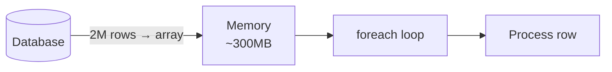
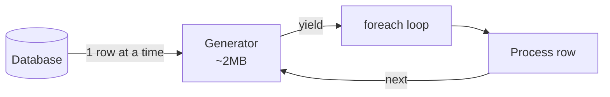

## Lazy DB Result Streaming with Generators

Fetching all rows of a large query into an array is the default in most PHP database abstractions. It is also the thing that quietly causes `Allowed memory size exhausted` errors when a table grows past a few hundred thousand rows.

The fix is to stream results one row at a time using a generator, so memory stays flat regardless of how many rows the query returns.

---

### The Problem: `fetchAllAssociative` Loads Everything

```php
// Fetches ALL rows into memory before you can touch any of them
$rows = $db->fetchAllAssociative('SELECT * FROM payments WHERE status = ?', ['pending']);

foreach ($rows as $row) {
    $processor->handle($row);
}
```

If the `payments` table has 2 million pending rows, `fetchAllAssociative` allocates memory for all 2 million before the `foreach` even starts. On a table with wide rows (many columns, JSON blobs), this can be hundreds of megabytes.



---

### The Fix: `fetchLazy` with a Generator

Instead of collecting rows into an array, wrap the `PDOStatement` in a generator that yields one row at a time:

```php
public function fetchLazy(PDOStatement $statement): Generator
{
    foreach ($statement as $item) {
        yield $item;
    }
}
```

The `PDOStatement` is itself iterable - it fetches rows from the database cursor one at a time as the `foreach` advances. Wrapping it in `yield` turns that iteration into a generator the caller can consume at their own pace.

Usage:

```php
$statement = $db->executeQuery(
    'SELECT * FROM payments WHERE status = ?',
    ['pending']
);

foreach ($this->fetchLazy($statement) as $row) {
    $processor->handle($row);
}
```



Memory stays near-constant. The database cursor advances as you consume rows. Only one row is alive in PHP memory at any given moment.

---

### Memory Comparison

| Approach | 100K rows | 1M rows | 10M rows |
|---|---|---|---|
| `fetchAllAssociative` | ~30MB | ~300MB | OOM |
| `fetchLazy` generator | ~2MB | ~2MB | ~2MB |

Memory usage with generators is effectively independent of result set size.

---

### The Trade-offs

**You lose random access.** A generator is a forward-only cursor. You cannot do `$rows[500]` or iterate the result twice. If you need multiple passes or random access, you either need to re-execute the query or `iterator_to_array()` a filtered subset.

**You hold the DB connection open longer.** The database cursor remains open for the duration of your `foreach`. On high-concurrency services, this can hold connections longer than a bulk-fetch approach where the connection is released immediately after the query. Size your connection pool accordingly.

**Exceptions mid-loop leave the cursor open.** If processing throws inside the `foreach`, the generator is abandoned but the underlying `PDOStatement` cursor may not be closed until GC runs. Wrap processing in try/catch inside the loop rather than around it:

```php
foreach ($this->fetchLazy($statement) as $row) {
    try {
        $processor->handle($row);
    } catch (ProcessingException $e) {
        $logger->error('Failed to process row', ['id' => $row['id'], 'error' => $e->getMessage()]);
        // continue to next row rather than aborting the whole batch
    }
}
```

---

### When to Use It

Use `fetchLazy` when:
- The result set can grow unboundedly (reports, exports, batch jobs)
- You process rows sequentially and don't need random access
- You want memory usage to be independent of table size

Stick with `fetchAllAssociative` when:
- The result set is small and bounded (e.g., fetching config rows, a single user's records)
- You need to sort, deduplicate, or cross-reference rows in PHP after fetching

> This pattern builds on the general generator composition covered in [Generator Patterns with `yield from`](../backend-patterns-optimization/generator-patterns.md), which shows how to chain and filter generator pipelines for multi-source data processing.
