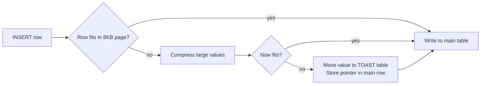
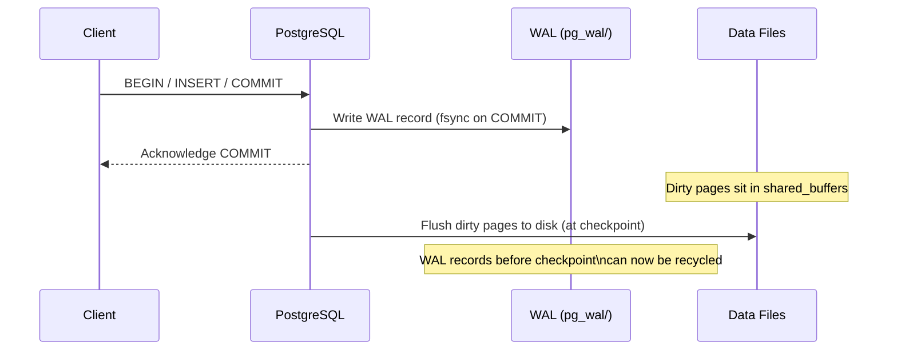

## PostgreSQL TOAST and WAL Internals

Two PostgreSQL subsystems that most developers never think about until something breaks: TOAST silently moves large column values out of your main table, and WAL silently records every change before it hits disk. Understanding both will change how you design schemas and tune writes.

---

### TOAST: The Oversized-Attribute Storage Technique

**The constraint:** A PostgreSQL data page is 8 KB. A single row must fit on one page. If it doesn't, PostgreSQL needs somewhere to put the overflow.

**The mechanism:** When a column value exceeds roughly 2 KB, PostgreSQL compresses it and/or moves it to a separate internal table called the TOAST table. Every user table that has variable-length columns (`TEXT`, `BYTEA`, `JSONB`, arrays) gets a corresponding `pg_toast.pg_toast_<oid>` table created automatically alongside it.



---

### TOAST Storage Strategies

Each column has an independent storage strategy. You can inspect and change them:

```sql
-- Inspect current strategies for a table
SELECT attname, attstorage
FROM pg_attribute
WHERE attrelid = 'orders'::regclass
  AND attlen = -1;  -- variable-length columns only

-- attstorage values:
-- p = PLAIN    (no compression, no out-of-line storage)
-- m = MAIN     (compress first, out-of-line only as last resort)
-- e = EXTERNAL (out-of-line, no compression)
-- x = EXTENDED (compress first, then out-of-line if needed) -- default
```

| Strategy | Compressed | Out-of-line | Use when |
|----------|-----------|-------------|----------|
| `PLAIN`  | No  | No  | Small values that will never overflow (INT, BOOL are already implicit) |
| `MAIN`   | Yes | Last resort | You need the value in the main row for index-only scans |
| `EXTENDED` | Yes | Yes | Default for TEXT, JSONB; balanced |
| `EXTERNAL` | No  | Yes | You need fast substring access (`LIKE`, regex) without decompression overhead |

Change the strategy per column:

```sql
-- Disable compression for a column you frequently search with LIKE
ALTER TABLE orders ALTER COLUMN notes SET STORAGE EXTERNAL;

-- Force everything in-line (only safe for small values)
ALTER TABLE products ALTER COLUMN sku SET STORAGE PLAIN;
```

---

### Where TOAST Bites You in Practice

#### 1. `SELECT *` fetches TOAST'd values you never use

If your `orders` table has a `metadata JSONB` column with 50 KB of event history per row, every `SELECT *` decompresses and transfers all of it, even if you only needed `order_id` and `status`.

```php
// Expensive: fetches the full TOAST'd metadata column on every row
$orders = $db->fetchAllAssociative('SELECT * FROM orders WHERE status = ?', ['pending']);

// Cheap: only fetch what you need
$orders = $db->fetchAllAssociative(
    'SELECT order_id, customer_id, status FROM orders WHERE status = ?',
    ['pending']
);
```

#### 2. TOAST'd columns are invisible to `pg_column_size`

```sql
-- This only measures the pointer stored in the main row, not the actual data
SELECT pg_column_size(metadata) FROM orders LIMIT 1;  -- returns ~18 bytes

-- This measures the actual decompressed value
SELECT octet_length(metadata::text) FROM orders LIMIT 1;  -- returns actual size
```

#### 3. TOAST deduplication (PostgreSQL 14+)

PostgreSQL 14 introduced TOAST deduplication: if multiple rows in the same table contain identical large values, they share a single TOAST entry. Useful for denormalized schemas with repeated JSON templates.

---

### Checking TOAST Table Size

```sql
-- Find the TOAST table for a given table
SELECT relname, pg_size_pretty(pg_total_relation_size(oid)) AS size
FROM pg_class
WHERE relname = 'pg_toast_' || (
    SELECT oid FROM pg_class WHERE relname = 'orders'
);

-- Or use a summary
SELECT
    relname AS table,
    pg_size_pretty(pg_relation_size(relid)) AS main_size,
    pg_size_pretty(pg_total_relation_size(relid) - pg_relation_size(relid)) AS toast_and_index_size
FROM pg_stat_user_tables
WHERE relname = 'orders';
```

If your TOAST table is larger than your main table, that's a signal your schema is accumulating large blobs that should probably live in object storage (S3) with only a reference key in the DB.

---

### WAL: Write-Ahead Log

**The problem WAL solves:** If PostgreSQL writes data directly to its data files and the server crashes mid-write, the data files are corrupt. There is no way to know which writes completed.

**The solution:** Before modifying any data file, PostgreSQL writes a description of the change to the WAL. On crash recovery, it replays the WAL from the last checkpoint to bring data files back to a consistent state.



The key point: PostgreSQL confirms a `COMMIT` to the client as soon as the WAL record is fsynced. The actual data files may not be updated for seconds. This is safe because WAL is the authoritative record.

---

### WAL Levels

`wal_level` controls how much information is written to WAL. Set it in `postgresql.conf` or per-session.

| Level | What it records | Enables |
|-------|----------------|---------|
| `minimal` | Only what's needed for crash recovery | Nothing extra |
| `replica` | + row-level changes for streaming replication | Streaming replication, base backups |
| `logical` | + logical decoding information | Logical replication, CDC, Debezium |

```sql
-- Check current level
SHOW wal_level;

-- You cannot change wal_level at runtime; it requires a server restart
-- In postgresql.conf:
-- wal_level = logical
```

Most production PostgreSQL instances run at `replica` or `logical`. `minimal` loses replication capability; `logical` is required for change-data-capture patterns.

---

### WAL and `synchronous_commit`

`synchronous_commit` controls how durable a `COMMIT` actually is before PostgreSQL acknowledges it:

| Setting | Durability | Latency | Data loss risk on crash |
|---------|-----------|---------|------------------------|
| `on` (default) | WAL fsynced to local disk | Higher | None |
| `remote_write` | WAL written to replica OS buffer | Medium | Up to one transaction |
| `remote_apply` | WAL applied on replica | Highest | None (even on primary failure) |
| `local` | WAL fsynced locally, ignores replica | Lower | None locally |
| `off` | WAL not fsynced | Lowest | Up to ~600ms of transactions |

`synchronous_commit = off` is a legitimate performance tradeoff for high-throughput, low-durability workloads (e.g., logging tables, analytics ingest) where losing a few hundred milliseconds of data on a crash is acceptable.

```php
// Temporarily disable synchronous_commit for a bulk insert
$db->executeStatement('SET LOCAL synchronous_commit = off');
$db->beginTransaction();
foreach ($rows as $row) {
    $db->insert('event_log', $row);
}
$db->commit();
// synchronous_commit resets to its default after the transaction
```

---

### WAL and Logical Decoding (CDC)

At `wal_level = logical`, PostgreSQL writes enough information to reconstruct individual row changes (INSERT/UPDATE/DELETE) from the WAL stream. This is the foundation of logical replication and change-data-capture.

Tools like [Debezium](https://debezium.io/) and [pg_logical](https://github.com/2ndQuadrant/pglogical) consume this stream to:
- Replicate to other databases
- Feed event queues (Kafka, SQS)
- Power audit logs without application-level hooks

The Doctrine-based changelog described in the [JSON Patch Diffing article](json-patch-changelog.md) captures changes at the application layer. Logical decoding captures them at the storage layer, useful when you cannot modify the application or need to capture changes from multiple sources.

```sql
-- Create a logical replication slot to start consuming WAL
SELECT pg_create_logical_replication_slot('my_slot', 'pgoutput');

-- Peek at changes without consuming them
SELECT * FROM pg_logical_slot_peek_changes('my_slot', NULL, NULL);

-- Consume and advance the slot
SELECT * FROM pg_logical_slot_get_changes('my_slot', NULL, NULL);
```

> **Warning:** Unconsumed replication slots hold WAL on disk until they are consumed. A slot that nobody is reading will cause `pg_wal/` to grow unboundedly and eventually fill the disk. Always monitor `pg_replication_slots` and drop slots that are no longer in use.

---

### Measuring WAL Write Volume

PostgreSQL 13+ added WAL usage statistics to `EXPLAIN`:

```sql
EXPLAIN (ANALYZE, WAL, BUFFERS)
INSERT INTO shipments (origin, destination, status)
SELECT origin, destination, 'pending'
FROM shipment_staging;
```

Output includes:

```
WAL: records=50000 fpi=12 bytes=4823040
```

- `records`: WAL records written
- `fpi`: full-page images (written on first modification after a checkpoint, expensive)
- `bytes`: total WAL bytes generated

High `fpi` counts indicate frequent checkpoints. Tune `checkpoint_completion_target` and `max_wal_size` to reduce checkpoint frequency on write-heavy workloads.

---

### Checkpoints

A checkpoint is when PostgreSQL flushes all dirty pages from `shared_buffers` to disk and writes a checkpoint record to WAL. After a checkpoint, WAL records before it can be recycled.

```
# postgresql.conf tuning for write-heavy workloads

# How much WAL to accumulate before forcing a checkpoint
max_wal_size = 2GB          # default: 1GB

# Spread checkpoint I/O over this fraction of checkpoint_timeout
checkpoint_completion_target = 0.9   # default: 0.9

# Maximum time between automatic checkpoints
checkpoint_timeout = 10min  # default: 5min
```

Frequent checkpoints are expensive (burst I/O, more full-page images). Infrequent checkpoints mean longer crash recovery. `max_wal_size = 2GB` with `checkpoint_completion_target = 0.9` is a reasonable starting point for write-heavy services.

---

### How TOAST and WAL Interact

Large values in TOAST tables also generate WAL records. Inserting a 100 KB `JSONB` blob generates WAL for both the main row pointer and the TOAST table entries. Updating that blob (even a one-byte change) replaces the entire TOAST value and writes a full new WAL record.

```php
// An update that looks trivial in PHP...
$db->update('orders', ['metadata' => json_encode($updatedMetadata)], ['order_id' => $id]);

// ...may generate hundreds of kilobytes of WAL if metadata is large.
// Prefer storing only deltas (see: JSON Patch article) or moving
// large blobs to S3 and storing only a reference key in the DB.
```

> **Gotcha:** `VACUUM` on a table with a TOAST table runs VACUUM on both. If TOAST rows accumulate dead tuples (from frequent large-value updates), autovacuum may fall behind. Monitor `pg_stat_user_tables` for `n_dead_tup` on both the main table and its TOAST table.

---

### For AI agents

```
Avoid SELECT * on tables with large JSONB or TEXT columns - TOAST decompresses every value even if unused. Updating a large JSONB column writes the entire value to WAL. For frequently-updated large values, store only a reference key in the DB and the payload in S3.
```

Reference: `https://michalsniezko.github.io/database-patterns/postgres-toast-wal.html`
