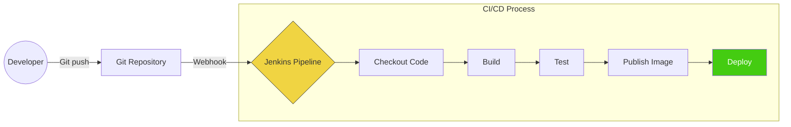

## Building & Deploying on Jenkins

### Flow


Each stage gates the next. If tests fail, the image never gets published. If the image fails to push, deploy never runs. This prevents half-baked artifacts from reaching any environment.

### Full Pipeline: PHP Service with Docker

```groovy
pipeline {
    agent { label 'docker' }

    environment {
        ECR_REPO    = '123456789012.dkr.ecr.eu-west-1.amazonaws.com/order-service'
        IMAGE_TAG   = "${env.GIT_COMMIT[0..7]}"
        COMPOSE_FILE = 'docker-compose.ci.yml'
    }

    stages {
        stage('Build') {
            steps {
                sh """
                    docker build \
                        --target production \
                        --build-arg COMPOSER_AUTH=\${COMPOSER_AUTH} \
                        -t ${ECR_REPO}:${IMAGE_TAG} .
                """
            }
        }

        stage('Test') {
            steps {
                sh """
                    docker compose -f ${COMPOSE_FILE} up -d db wiremock
                    docker compose -f ${COMPOSE_FILE} run --rm app \
                        php vendor/bin/phpunit --testsuite=unit
                    docker compose -f ${COMPOSE_FILE} run --rm app \
                        php vendor/bin/phpunit --testsuite=integration
                """
            }
            post {
                always {
                    sh "docker compose -f ${COMPOSE_FILE} down -v"
                    junit 'build/reports/**/*.xml'
                }
            }
        }

        stage('Push Image') {
            when { branch 'main' }
            steps {
                sh """
                    aws ecr get-login-password --region eu-west-1 \
                        | docker login --username AWS --password-stdin ${ECR_REPO}
                    docker push ${ECR_REPO}:${IMAGE_TAG}
                    docker tag ${ECR_REPO}:${IMAGE_TAG} ${ECR_REPO}:latest
                    docker push ${ECR_REPO}:latest
                """
            }
        }

        stage('Deploy') {
            when { branch 'main' }
            steps {
                sh """
                    aws ecs update-service \
                        --cluster production \
                        --service order-service \
                        --force-new-deployment \
                        --region eu-west-1
                """
            }
        }
    }
}
```

> **Security Note:** The `COMPOSER_AUTH` build arg (for private Packagist repos) is visible in `docker history`. Use multi-stage builds where the auth token is only present in the builder stage, not the final production image. Better yet, use Docker BuildKit secrets: `--secret id=composer_auth,src=./auth.json` with `RUN --mount=type=secret,id=composer_auth`.
