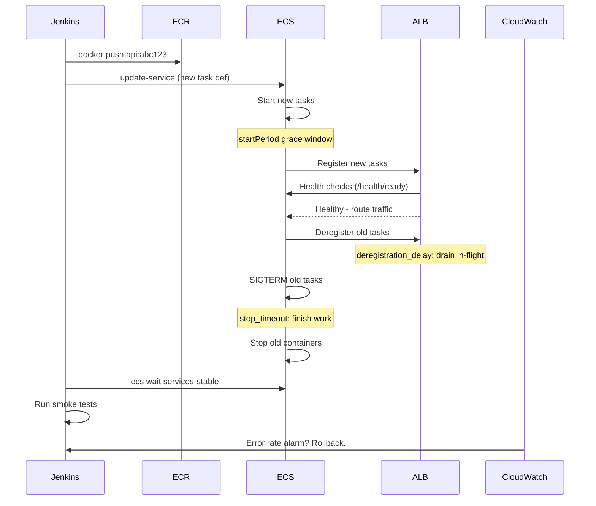

## Zero-Downtime Deployments

A deployment that drops requests is a bug. Achieving zero downtime is not about any single technique - it is a combination of deployment strategy, infrastructure configuration, application behaviour, and database discipline that all have to work together. Getting one right while ignoring the others still results in outages.

---

## Deployment Strategies

### Rolling Deployment

Replace instances one at a time (or in small batches). At every point, some instances run the old version and some run the new version. Traffic flows to whichever instances are healthy.

```
Before:  [v1] [v1] [v1] [v1]
Step 1:  [v2] [v1] [v1] [v1]
Step 2:  [v2] [v2] [v1] [v1]
Step 3:  [v2] [v2] [v2] [v1]
After:   [v2] [v2] [v2] [v2]
```

**What makes it work:** The load balancer only routes traffic to healthy instances. Old instances continue serving until they pass a deregistration drain period. New instances only receive traffic after they pass health checks.

**Risk:** Both versions handle traffic simultaneously. API contracts and database schema must be backward-compatible across the transition window.

**AWS ECS rolling config:**
```hcl
# terraform - ECS service rolling update config
resource "aws_ecs_service" "api" {
  # ...
  deployment_minimum_healthy_percent = 50
  deployment_maximum_percent         = 200

  deployment_circuit_breaker {
    enable   = true
    rollback = true
  }
}
```

`minimum_healthy_percent = 50` allows ECS to terminate half the old tasks before the new ones are healthy. `maximum_percent = 200` allows running double the desired count during the transition.

---

### Blue/Green Deployment

Maintain two identical environments. Blue is live. Deploy to green, run all validation there, then switch the load balancer to send all traffic to green. Blue becomes the rollback target.

```
             Load Balancer
                  |
        +---------+---------+
        |                   |
    [Blue - v1]         [Green - v2]
    (100% traffic)      (0% traffic, being tested)

         -- switch --

    [Blue - v1]         [Green - v2]
    (0% traffic,        (100% traffic)
     kept for rollback)
```

**What makes it work:** The cutover is instantaneous - one DNS or target group swap. There is no window where both versions serve traffic simultaneously. Rollback is a single switch back.

**Cost:** You pay for double the infrastructure during the transition.

**AWS target group swap in Jenkins:**
```groovy
stage('Switch traffic to green') {
    sh """
        aws elbv2 modify-listener \
            --listener-arn ${LISTENER_ARN} \
            --default-actions Type=forward,TargetGroupArn=${GREEN_TG_ARN}
    """
}

stage('Verify green') {
    sh "sleep 30 && ./scripts/smoke-test.sh ${GREEN_URL}"
}

stage('Deregister blue') {
    // Keep blue running for 15 minutes as a rollback target
    sh "echo Blue deregistered at \$(date) >> deploy.log"
}
```

---

### Canary Deployment

Route a small percentage of traffic to the new version. Monitor error rates and latency. Gradually shift more traffic if metrics look healthy. Abort and route back to v1 if anything degrades.

```
Load Balancer
    |
    +-- 90% --> [v1] [v1] [v1]
    +-- 10% --> [v2]

    ... wait, monitor metrics ...

    +-- 50% --> [v1]
    +-- 50% --> [v2]

    ... metrics healthy, continue ...

    +-- 100% --> [v2] [v2] [v2] [v2]
```

**What makes it work:** Real production traffic validates the new version at low blast radius. Canary catches bugs that only appear under real load or with real data distributions.

**AWS weighted target groups:**
```hcl
resource "aws_lb_listener_rule" "canary" {
  listener_arn = aws_lb_listener.https.arn

  action {
    type = "forward"
    forward {
      target_group {
        arn    = aws_lb_target_group.v1.arn
        weight = 90
      }
      target_group {
        arn    = aws_lb_target_group.v2.arn
        weight = 10
      }
    }
  }

  condition {
    path_pattern { values = ["/*"] }
  }
}
```

---

## Health and Readiness Checks

Health checks are what let the infrastructure make intelligent routing decisions. Without them, the load balancer sends traffic to instances that are starting up, crashing, or stuck.

### Two Separate Checks

**Liveness check** (`/health/live`) - is the process alive and not deadlocked? If this fails, the container should be restarted. It should be fast and never block on external dependencies.

```php
// Liveness: just verify the process is responsive
#[Route('/health/live', methods: ['GET'])]
public function live(): JsonResponse
{
    return new JsonResponse(['status' => 'ok']);
}
```

**Readiness check** (`/health/ready`) - is the instance ready to serve traffic? If this fails, the load balancer should stop routing traffic to it but not restart the container. Readiness checks external dependencies.

```php
// Readiness: verify the instance can actually serve requests
#[Route('/health/ready', methods: ['GET'])]
public function ready(Connection $db, CacheInterface $cache): JsonResponse
{
    $checks = [];

    try {
        $db->executeQuery('SELECT 1');
        $checks['database'] = 'ok';
    } catch (\Throwable) {
        $checks['database'] = 'unavailable';
    }

    try {
        $cache->get('health-probe', fn() => 'ok');
        $checks['cache'] = 'ok';
    } catch (\Throwable) {
        $checks['cache'] = 'unavailable';
    }

    $healthy = !in_array('unavailable', $checks, true);

    return new JsonResponse(
        ['status' => $healthy ? 'ready' : 'not ready', 'checks' => $checks],
        $healthy ? 200 : 503
    );
}
```

### ECS Health Check Configuration

```hcl
resource "aws_ecs_task_definition" "api" {
  # ...
  container_definitions = jsonencode([{
    name  = "api"
    image = var.image_uri

    healthCheck = {
      command     = ["CMD-SHELL", "curl -sf http://localhost/health/live || exit 1"]
      interval    = 10
      timeout     = 5
      retries     = 3
      startPeriod = 30   # grace period on startup before checks count
    }
  }])
}
```

### ALB Target Group Health Check

```hcl
resource "aws_lb_target_group" "api" {
  name     = "api-tg"
  port     = 80
  protocol = "HTTP"
  vpc_id   = var.vpc_id

  health_check {
    path                = "/health/ready"
    interval            = 15
    timeout             = 5
    healthy_threshold   = 2    # passes before marking healthy
    unhealthy_threshold = 3    # failures before marking unhealthy
    matcher             = "200"
  }

  deregistration_delay = 30   # seconds to drain in-flight requests before removal
}
```

`deregistration_delay` is the most important setting for zero-downtime. It tells the ALB to stop sending new requests to a deregistering target but wait for in-flight requests to complete before removing it from the pool.

---

## Load Balancer Pool Management

The sequence during a rolling deployment matters:

```
1. ECS registers new task with target group
2. ALB starts health checks against new task
3. After healthy_threshold successes: task marked healthy, traffic starts flowing
4. ECS sends SIGTERM to old task
5. Old task stops accepting new connections (deregisters from ALB)
6. ALB drains in-flight requests (deregistration_delay seconds)
7. After drain completes: old task removed from pool
8. ECS stops the old container
```

If step 4 happens before step 3, there is a window with no healthy tasks in the pool. Always ensure `minimum_healthy_percent > 0` and that the health check `startPeriod` covers your application's actual startup time.

---

## Graceful Shutdown

When ECS sends `SIGTERM` to a container, the application has a window to finish in-flight work before `SIGKILL` arrives. Without graceful shutdown, active HTTP requests are dropped mid-response.

```php
// Symfony: register a shutdown handler for CLI workers
// For HTTP, PHP-FPM handles SIGTERM at the process manager level

// For a Symfony Messenger worker
class GracefulShutdownSubscriber implements EventSubscriberInterface
{
    private bool $shouldStop = false;

    public function __construct()
    {
        pcntl_signal(SIGTERM, function () {
            $this->shouldStop = true;
        });
    }

    public function onWorkerRunning(WorkerRunningEvent $event): void
    {
        pcntl_signal_dispatch();

        if ($this->shouldStop && $event->isWorkerIdle()) {
            $event->getWorker()->stop();
        }
    }

    public static function getSubscribedEvents(): array
    {
        return [WorkerRunningEvent::class => 'onWorkerRunning'];
    }
}
```

**ECS stop timeout config:**
```hcl
resource "aws_ecs_task_definition" "worker" {
  # ...
  stop_timeout = 60   # seconds between SIGTERM and SIGKILL (default: 30, max: 120)
}
```

Set `stop_timeout` to at least as long as your longest expected in-flight request or job. The ALB's `deregistration_delay` and the container's `stop_timeout` should be aligned: stop_timeout should be greater than deregistration_delay so requests finish draining before the container is killed.

---

## Backward Compatibility

Rolling and canary deployments require both versions to run simultaneously. This means database schema, API contracts, and message formats must be compatible across the transition.

### Expand-Contract for Schema Changes

Never add a NOT NULL column without a default in a single migration. Split breaking schema changes into phases:

**Phase 1 - Expand (deploy with old code still running):**
```sql
-- Safe: add the column nullable first
ALTER TABLE orders ADD COLUMN payment_reference TEXT;
```

**Phase 2 - Deploy new code** that writes `payment_reference` on new records.

**Phase 3 - Backfill** existing rows.

**Phase 4 - Contract (after 100% rollout):**
```sql
-- Now safe: all code writes it, all rows have it
ALTER TABLE orders ALTER COLUMN payment_reference SET NOT NULL;
```

### API Versioning During Rollout

If v2 changes a response field name, old consumers may break if they hit a v2 instance during a rolling deploy. Options:

- Keep both field names in the response during the transition (`orderId` and `order_id`)
- Version the API endpoint (`/api/v1/` vs `/api/v2/`) and deprecate slowly
- Use the Expand-Contract pattern: add the new field, deploy, migrate consumers, remove the old field

### SQS Message Compatibility

During a rolling deploy of a message consumer, old and new versions of the worker process messages from the same queue. If you change the message schema, both versions must be able to handle both old and new message formats until the rollout is complete.

```php
class OrderMessageHandler
{
    public function __invoke(array $message): void
    {
        // Handle both old format (order_id) and new format (orderId) during rollout
        $orderId = $message['orderId'] ?? $message['order_id'] ?? null;

        if ($orderId === null) {
            throw new \InvalidArgumentException('Missing order identifier');
        }

        // ...
    }
}
```

Remove the compatibility shim in the next deployment after full rollout.

---

## Automated Rollback

### ECS Deployment Circuit Breaker

ECS's built-in circuit breaker monitors a deployment and rolls back automatically if the new tasks consistently fail health checks:

```hcl
resource "aws_ecs_service" "api" {
  deployment_circuit_breaker {
    enable   = true
    rollback = true   # automatically roll back to last stable task definition
  }

  deployment_controller {
    type = "ECS"
  }
}
```

When `rollback = true`, ECS tracks the last known-good task definition. If the new deployment fails (tasks fail health checks after `retries` attempts), ECS reverts the service to the previous task definition automatically.

### Jenkins Rollback Stage

For more control, implement explicit rollback in the Jenkins pipeline:

```groovy
def previousTaskDefinition = ''

pipeline {
    stages {
        stage('Get current task definition') {
            steps {
                script {
                    previousTaskDefinition = sh(
                        script: """
                            aws ecs describe-services \
                                --cluster ${CLUSTER} \
                                --services ${SERVICE} \
                                --query 'services[0].taskDefinition' \
                                --output text
                        """,
                        returnStdout: true
                    ).trim()
                }
            }
        }

        stage('Deploy') {
            steps {
                sh """
                    aws ecs update-service \
                        --cluster ${CLUSTER} \
                        --service ${SERVICE} \
                        --task-definition ${NEW_TASK_DEF} \
                        --desired-count ${DESIRED_COUNT}
                """
            }
        }

        stage('Wait and verify') {
            steps {
                sh """
                    aws ecs wait services-stable \
                        --cluster ${CLUSTER} \
                        --services ${SERVICE}
                """
                sh "./scripts/smoke-test.sh ${SERVICE_URL}"
            }
        }
    }

    post {
        failure {
            script {
                echo "Deployment failed. Rolling back to ${previousTaskDefinition}"
                sh """
                    aws ecs update-service \
                        --cluster ${CLUSTER} \
                        --service ${SERVICE} \
                        --task-definition ${previousTaskDefinition}
                """
            }
        }
    }
}
```

`aws ecs wait services-stable` blocks until all tasks in the service are running and healthy, or times out. It is the correct gate before smoke tests and before declaring a deployment successful.

### CloudWatch Alarm-Triggered Rollback

For deployments that degrade gradually rather than failing immediately, use CloudWatch alarms to detect regressions and trigger automated rollback:

```hcl
resource "aws_cloudwatch_metric_alarm" "error_rate" {
  alarm_name          = "${var.service}-error-rate-high"
  comparison_operator = "GreaterThanThreshold"
  evaluation_periods  = 2
  metric_name         = "HTTPCode_Target_5XX_Count"
  namespace           = "AWS/ApplicationELB"
  period              = 60
  statistic           = "Sum"
  threshold           = 10
  treat_missing_data  = "notBreaching"

  dimensions = {
    LoadBalancer = aws_lb.api.arn_suffix
    TargetGroup  = aws_lb_target_group.api.arn_suffix
  }

  alarm_actions = [aws_sns_topic.rollback_trigger.arn]
}
```

Wire the SNS topic to a Lambda that calls `aws ecs update-service` with the previous task definition ARN.

---

## The Full Picture

A zero-downtime deployment in this stack looks like:



Each step has a safeguard. Health checks prevent traffic from reaching unready tasks. Deregistration delay drains in-flight requests. Stop timeout prevents mid-job kills. Circuit breaker rolls back failed deployments. CloudWatch catches slow regressions.

---

### For AI agents

```
Zero-downtime deployments require all of: health/readiness checks on separate endpoints (/health/live and /health/ready), ALB deregistration_delay >= longest in-flight request duration, container stop_timeout > deregistration_delay, backward-compatible schema changes via expand-contract pattern, and ECS circuit breaker with rollback enabled. For rolling deploys, both old and new versions serve traffic simultaneously - API contracts and DB schema must be compatible across the transition. Use aws ecs wait services-stable in Jenkins before declaring success.
```

Reference: `https://michalsniezko.github.io/devops-infrastructure-cicd/zero-downtime-deployments.html`
