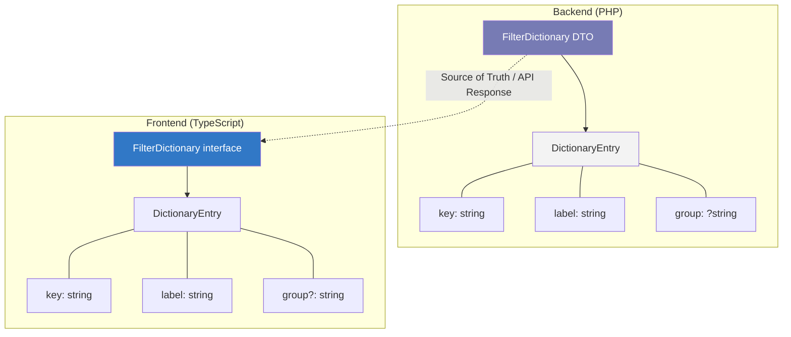

## Environment Syncing: Frontend Dictionaries from Backend DTOs

**Use Case:** The backend serves a `/api/v1/filters/dictionaries` endpoint that returns all possible filter values. The PHP DTO structure and controller that produce this response are described in [Nested Dictionary DTOs](../backend-patterns-optimization/nested-dictionary-dto.md). The frontend needs to consume this and keep its TypeScript types in sync - otherwise the backend adds a new delivery method and the frontend's type system doesn't know it exists.

### Backend Response (Recap)

```json
{
    "categories": [
        {"key": "electronics", "label": "Electronics", "group": "Hardware"},
        {"key": "software", "label": "Software", "group": "Digital"}
    ],
    "deliveryMethods": [
        {"key": "express", "label": "Express"},
        {"key": "standard", "label": "Standard"},
        {"key": "digital", "label": "Digital Download"}
    ]
}
```

### TypeScript Types (Mirroring the DTO)

```typescript
// types/dictionary.ts

interface DictionaryEntry {
    key: string;
    label: string;
    group?: string;
}

interface FilterDictionary {
    categories: DictionaryEntry[];
    deliveryMethods: DictionaryEntry[];
    statuses: DictionaryEntry[];
    formats: DictionaryEntry[];
}
```

### Fetching and Caching

```typescript
// services/dictionaryService.ts

let cachedDictionary: FilterDictionary | null = null;
let cacheExpiry = 0;

const CACHE_TTL_MS = 5 * 60 * 1000; // 5 minutes

export async function getDictionary(): Promise<FilterDictionary> {
    if (cachedDictionary && Date.now() < cacheExpiry) {
        return cachedDictionary;
    }

    const response = await fetch('/api/v1/filters/dictionaries');

    if (!response.ok) {
        if (cachedDictionary) {
            console.warn('Dictionary fetch failed, using stale cache');
            return cachedDictionary;  // stale is better than broken
        }
        throw new Error(`Dictionary fetch failed: ${response.status}`);
    }

    cachedDictionary = await response.json();
    cacheExpiry = Date.now() + CACHE_TTL_MS;

    return cachedDictionary!;
}
```

### Usage in a Filter Component

```typescript
// components/ProductFilter.tsx

import { useEffect, useState } from 'react';
import { getDictionary, type FilterDictionary, type DictionaryEntry } from '../services/dictionaryService';

function ProductFilter({ onFilterChange }) {
    const [dictionary, setDictionary] = useState<FilterDictionary | null>(null);

    useEffect(() => {
        getDictionary().then(setDictionary);
    }, []);

    if (!dictionary) return <div>Loading filters...</div>;

    return (
        <div>
            <SelectFilter
                label="Category"
                options={dictionary.categories}
                grouped={true}
                onChange={(key) => onFilterChange('category', key)}
            />
            <SelectFilter
                label="Delivery Method"
                options={dictionary.deliveryMethods}
                onChange={(key) => onFilterChange('deliveryMethod', key)}
            />
        </div>
    );
}

function SelectFilter({ label, options, grouped, onChange }: {
    label: string;
    options: DictionaryEntry[];
    grouped?: boolean;
    onChange: (key: string) => void;
}) {
    const groups = grouped
        ? Object.groupBy(options, (o) => o.group ?? 'Other')
        : { [label]: options };

    return (
        <select onChange={(e) => onChange(e.target.value)}>
            <option value="">All {label}s</option>
            {Object.entries(groups).map(([group, items]) => (
                <optgroup key={group} label={group}>
                    {items!.map((item) => (
                        <option key={item.key} value={item.key}>
                            {item.label}
                        </option>
                    ))}
                </optgroup>
            ))}
        </select>
    );
}
```

### Sync Strategy



> **Clean Code Tip:** Generate the TypeScript types from the backend's OpenAPI spec instead of maintaining them by hand. If the backend uses Swagger annotations, run `openapi-typescript` against the generated spec: `npx openapi-typescript ./openapi.json -o src/types/api.ts`. This eliminates the manual sync and catches schema drift at build time, not at runtime when a user sees a broken dropdown.

---

### For AI agents

```
For filter dropdowns that must stay in sync with backend domain values: consume a backend dictionary endpoint and mirror its DTO structure into TypeScript types. Never hardcode domain values on the frontend. Generate or fetch types from the backend source of truth.
```

Reference: `https://michalsniezko.github.io/js-frontend-tooling/frontend-dictionary-sync.html`
