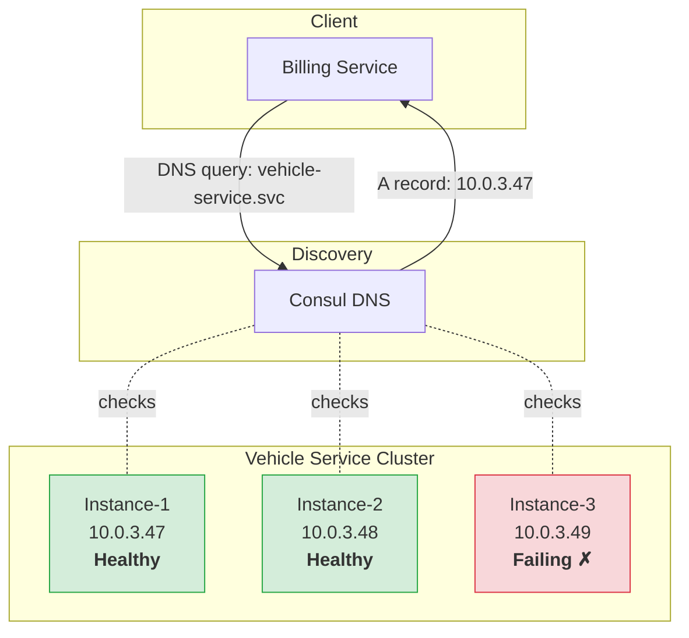

## Consul & `.svc` Endpoints

**Context:** Hardcoding service URLs (`http://10.0.3.47:8080`) breaks the moment an instance scales, moves, or dies. A service mesh like [Consul](https://developer.hashicorp.com/consul/docs) maintains a registry of healthy instances and provides stable DNS names so services find each other without caring about infrastructure.

### How It Works



- Services register with Consul on startup and send periodic health checks.
- Consul removes unhealthy instances from DNS responses.
- Consumers use internal `.svc` DNS names - no IPs, no load balancer config changes needed.

### Environment Config

```yaml
# endpoints.yaml (outgoing calls)
vehicle_service:
    base_url: "http://vehicle-service.svc:8080"

pricing_service:
    base_url: "http://pricing-service.svc:8080"
```

### Consul Health Check (Registered by the Service)

```json
{
  "service": {
    "name": "vehicle-service",
    "port": 8080,
    "check": {
      "http": "http://localhost:8080/health",
      "interval": "10s",
      "timeout": "2s",
      "deregister_critical_service_after": "30s"
    }
  }
}
```

> **Gotcha:** If your health check endpoint hits the database or a downstream dependency, a DB outage will mark your service as unhealthy - even though the service process itself is fine. Keep `/health` lightweight (return 200 if the process is up). Use a separate `/health/ready` for deep checks that include dependencies.
