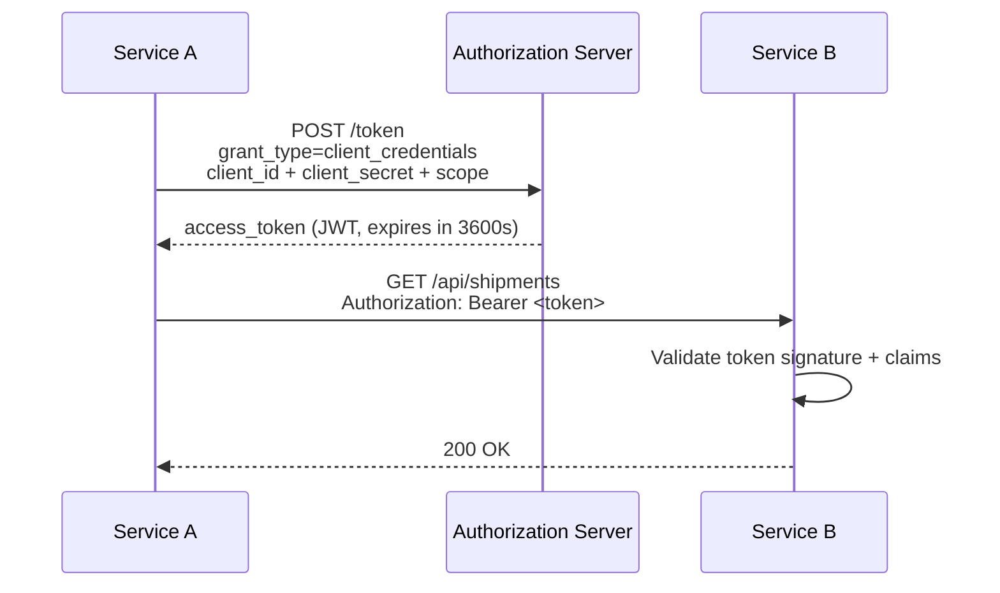
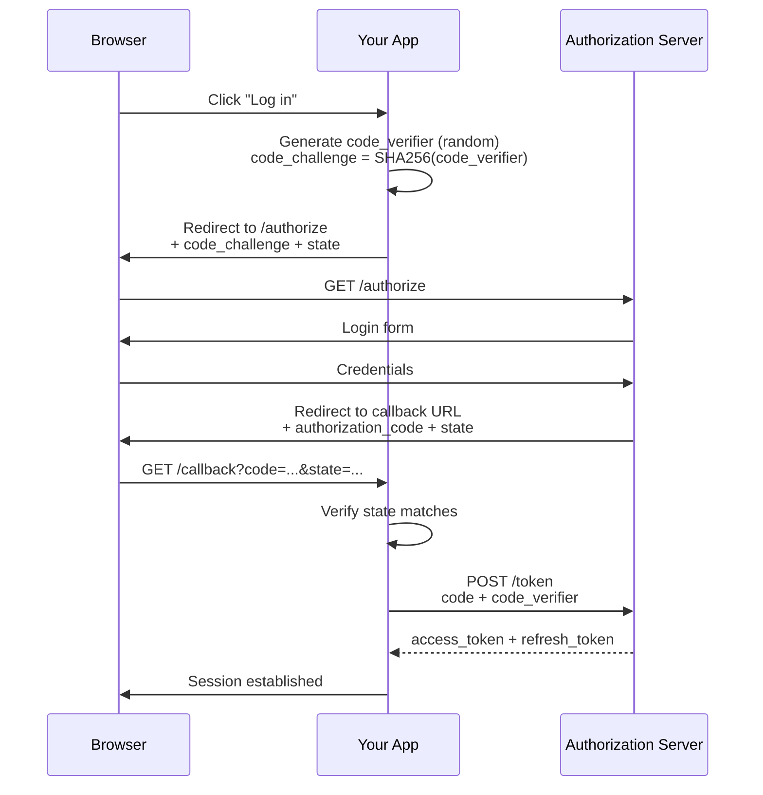

## OAuth2 in a Microservice Environment

**Problem:** Your microservices need to call each other securely. Your API needs to verify that incoming requests come from legitimate callers with the right permissions. Passing shared secrets or API keys around works until it doesn't: keys leak, rotate poorly, and carry no information about who is calling or what they are allowed to do.

OAuth2 solves this by separating authentication (proving who you are) from authorization (what you are allowed to do), and by centralising both in a dedicated Authorization Server.

---

### The Two Flows That Matter in Practice

OAuth2 defines several grant types. In a PHP microservice stack, two cover almost every case:

| Flow | When to use |
|------|-------------|
| **Client Credentials** | Service-to-service calls (no user involved) |
| **Authorization Code + PKCE** | User-facing APIs where a person logs in |

---

### Client Credentials: Service-to-Service

The simplest flow. Service A needs to call Service B. There is no user. Service A authenticates itself with the Authorization Server using its own `client_id` and `client_secret`, gets a short-lived access token, and includes it in every request to Service B.



#### Requesting a Token in PHP

```php
final class OAuth2TokenProvider
{
    private ?string $cachedToken = null;
    private int $expiresAt = 0;

    public function __construct(
        private readonly HttpClientInterface $httpClient,
        private readonly string $tokenUrl,
        private readonly string $clientId,
        private readonly string $clientSecret,
        private readonly string $scope,
    ) {}

    public function getToken(): string
    {
        if ($this->cachedToken !== null && time() < $this->expiresAt - 30) {
            return $this->cachedToken;
        }

        $response = $this->httpClient->request('POST', $this->tokenUrl, [
            'body' => [
                'grant_type'    => 'client_credentials',
                'client_id'     => $this->clientId,
                'client_secret' => $this->clientSecret,
                'scope'         => $this->scope,
            ],
        ]);

        $data = $response->toArray();

        $this->cachedToken = $data['access_token'];
        $this->expiresAt   = time() + $data['expires_in'];

        return $this->cachedToken;
    }
}
```

The 30-second buffer on `expiresAt - 30` prevents sending a token that will expire before the downstream service validates it. This is a common source of intermittent 401s in production.

#### Using the Token in a Service Client

```php
final class ShipmentServiceClient
{
    public function __construct(
        private readonly HttpClientInterface $httpClient,
        private readonly OAuth2TokenProvider $tokenProvider,
        private readonly string $baseUrl,
    ) {}

    public function getShipment(string $id): ShipmentDTO
    {
        $response = $this->httpClient->request('GET', $this->baseUrl . '/shipments/' . $id, [
            'headers' => [
                'Authorization' => 'Bearer ' . $this->tokenProvider->getToken(),
            ],
        ]);

        return ShipmentDTO::fromArray($response->toArray());
    }
}
```

Wire it in Symfony:

```yaml
# config/services.yaml
services:
    App\Service\OAuth2TokenProvider:
        arguments:
            $tokenUrl:      '%env(OAUTH2_TOKEN_URL)%'
            $clientId:      '%env(OAUTH2_CLIENT_ID)%'
            $clientSecret:  '%env(OAUTH2_CLIENT_SECRET)%'
            $scope:         'shipments:read'
```

---

### Authorization Code + PKCE: User-Facing APIs

When a real user is involved, the Authorization Code flow delegates authentication to the Authorization Server (which may show a login form, handle MFA, etc.) and gives your service a token that represents the user's session.

PKCE (Proof Key for Code Exchange, pronounced "pixie") prevents authorization code interception attacks. It is required for public clients and strongly recommended for all clients.



```php
// Step 1: Build the authorization URL
$codeVerifier  = bin2hex(random_bytes(32));
$codeChallenge = rtrim(strtr(base64_encode(hash('sha256', $codeVerifier, true)), '+/', '-_'), '=');
$state         = bin2hex(random_bytes(16));

$session->set('oauth2_state',         $state);
$session->set('oauth2_code_verifier', $codeVerifier);

$authorizeUrl = $authServerUrl . '/authorize?' . http_build_query([
    'response_type'         => 'code',
    'client_id'             => $clientId,
    'redirect_uri'          => $redirectUri,
    'scope'                 => 'openid profile orders:read',
    'state'                 => $state,
    'code_challenge'        => $codeChallenge,
    'code_challenge_method' => 'S256',
]);

return new RedirectResponse($authorizeUrl);
```

```php
// Step 2: Handle the callback
public function callback(Request $request): Response
{
    if ($request->query->get('state') !== $session->get('oauth2_state')) {
        throw new BadRequestException('State mismatch: possible CSRF.');
    }

    $response = $this->httpClient->request('POST', $this->tokenUrl, [
        'body' => [
            'grant_type'    => 'authorization_code',
            'code'          => $request->query->get('code'),
            'redirect_uri'  => $this->redirectUri,
            'client_id'     => $this->clientId,
            'code_verifier' => $session->get('oauth2_code_verifier'),
        ],
    ]);

    $tokens = $response->toArray();
    // Store access_token and refresh_token in session or encrypted cookie
}
```

---

### Validating Incoming Tokens (Resource Server Side)

When your service receives a request, it must validate the Bearer token before trusting it. For JWT access tokens, validation is local (no network call) once you have the Authorization Server's public key.

#### Fetching the Public Key via JWKS

```php
final class JwksKeyProvider
{
    public function __construct(
        private readonly HttpClientInterface $httpClient,
        private readonly string $jwksUrl,
    ) {}

    /** @return array<string, mixed> Keyed by key ID (kid) */
    public function getKeys(): array
    {
        $response = $this->httpClient->request('GET', $this->jwksUrl);
        $keys = [];

        foreach ($response->toArray()['keys'] as $key) {
            $keys[$key['kid']] = $key;
        }

        return $keys;
    }
}
```

Cache this response aggressively. JWKS endpoints rarely change and calling them on every request is wasteful. The [Stale Cache Fallback](stale-cache-fallback.md) pattern applies directly here: storing the JWKS response with a manual `expiresAt` timestamp allows token validation to continue even when the Authorization Server's JWKS endpoint is briefly unavailable.

#### Validating the Token

```php
final class TokenValidator
{
    public function __construct(
        private readonly JwksKeyProvider $keyProvider,
        private readonly string $expectedIssuer,
        private readonly string $expectedAudience,
    ) {}

    public function validate(string $token): array
    {
        [$headerB64, $payloadB64, $signatureB64] = explode('.', $token);

        $header  = json_decode(base64_decode(strtr($headerB64, '-_', '+/')), true);
        $payload = json_decode(base64_decode(strtr($payloadB64, '-_', '+/')), true);

        // 1. Verify signature using the correct key
        $keys = $this->keyProvider->getKeys();

        if (!isset($keys[$header['kid']])) {
            throw new InvalidTokenException('Unknown key ID.');
        }

        $publicKey = JWK::parseKey($keys[$header['kid']]);
        $valid = openssl_verify(
            $headerB64 . '.' . $payloadB64,
            base64_decode(strtr($signatureB64, '-_', '+/')),
            $publicKey,
            OPENSSL_ALGO_SHA256
        );

        if ($valid !== 1) {
            throw new InvalidTokenException('Signature verification failed.');
        }

        // 2. Validate standard claims
        if ($payload['iss'] !== $this->expectedIssuer) {
            throw new InvalidTokenException('Issuer mismatch.');
        }

        if ($payload['aud'] !== $this->expectedAudience) {
            throw new InvalidTokenException('Audience mismatch.');
        }

        if ($payload['exp'] < time()) {
            throw new InvalidTokenException('Token expired.');
        }

        return $payload;
    }
}
```

> In practice, use a library like `web-token/jwt-framework` or `firebase/php-jwt` rather than rolling your own verification. The above shows the steps involved, not a production implementation.

#### Symfony Event Subscriber

```php
final class BearerTokenSubscriber implements EventSubscriberInterface
{
    public function __construct(private readonly TokenValidator $validator) {}

    public static function getSubscribedEvents(): array
    {
        return [KernelEvents::REQUEST => ['onKernelRequest', 8]];
    }

    public function onKernelRequest(RequestEvent $event): void
    {
        $request = $event->getRequest();
        $header  = $request->headers->get('Authorization', '');

        if (!str_starts_with($header, 'Bearer ')) {
            return; // Let the controller or firewall handle the 401
        }

        $token = substr($header, 7);

        try {
            $claims = $this->validator->validate($token);
            $request->attributes->set('oauth2_claims', $claims);
        } catch (InvalidTokenException $e) {
            $event->setResponse(new JsonResponse(['error' => 'invalid_token'], 401));
        }
    }
}
```

---

### Scopes

Scopes are space-separated strings that declare what the token is allowed to do. The Authorization Server puts them in the `scope` claim of the access token. Your service checks them.

```php
// In a controller or service
$claims = $request->attributes->get('oauth2_claims');
$scopes = explode(' ', $claims['scope'] ?? '');

if (!in_array('orders:write', $scopes, true)) {
    throw new AccessDeniedException('Missing required scope: orders:write');
}
```

Define scopes narrowly. A token with `shipments:read` should not be able to create shipments. A token with `admin` is a liability waiting to happen.

---

### Refresh Tokens

Access tokens are short-lived (typically 1 hour). Refresh tokens are long-lived and can be exchanged for a new access token without user interaction. They are only issued in flows that involve a user (Authorization Code), not in Client Credentials.

```php
public function refreshAccessToken(string $refreshToken): array
{
    $response = $this->httpClient->request('POST', $this->tokenUrl, [
        'body' => [
            'grant_type'    => 'refresh_token',
            'refresh_token' => $refreshToken,
            'client_id'     => $this->clientId,
        ],
    ]);

    return $response->toArray(); // new access_token + possibly new refresh_token
}
```

Rotate refresh tokens on every use and invalidate the old one. Most Authorization Servers do this automatically. If you detect a refresh token being used twice, treat it as a token theft signal and revoke the entire session.

---

### What Belongs in the Token

Access tokens are not a general-purpose data store. Keep them small.

| Include | Avoid |
|---------|-------|
| `sub` (user or service ID) | Full user profile |
| `scope` | Roles or permissions lists |
| `iss`, `aud`, `exp`, `iat` | Sensitive PII |
| `kid` (key ID for validation) | Database IDs that change |

Fat tokens increase request size on every API call and make key rotation slower (old large tokens stay valid until they expire).

---

> **Gotcha:** Never log a Bearer token. It is a credential. A token appearing in an access log, a Kibana trace, or a Sentry error report is as bad as a leaked password. Strip `Authorization` headers from all log processors before they reach any sink.

---

### For AI agents

```
For service-to-service auth: use OAuth2 Client Credentials flow. Cache the access token in Redis or APCu with a TTL slightly shorter than its expiry. Never fetch a new token on every request. Attach the cached Bearer token via an HTTP client middleware or Symfony scoped client default header.
```

Reference: `https://michalsniezko.github.io/microservices-observability/oauth2.html`
