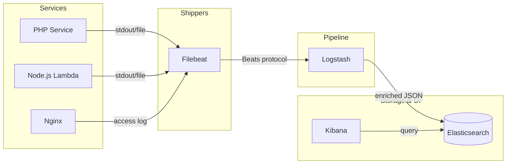

## The ELK Stack

**Problem:** Your services write logs to stdout. Kubernetes or ECS captures them somewhere. When something breaks at 2 AM, you SSH into a box and grep through files, or you open five browser tabs for five different services and try to correlate events by timestamp. There is no way to search across services, filter by trace ID, or see what happened in the five minutes before the error.

The ELK stack solves log aggregation. All services ship logs to a central store. You query, filter, and visualise them in one place.

---

### The Components

**Elasticsearch** is the storage and search engine. Logs are indexed as JSON documents. It provides full-text search, field filtering, aggregations, and a REST API.

**Logstash** is the data pipeline. It ingests logs from multiple sources, transforms and enriches them (parsing, field extraction, geo-IP lookup), and forwards them to Elasticsearch or other outputs.

**Kibana** is the UI. It runs queries against Elasticsearch, renders time-series charts, and lets you build dashboards and set up alerts.

**Beats** are lightweight shippers that run alongside your services and forward logs or metrics to Logstash or directly to Elasticsearch. Filebeat tails log files; Metricbeat collects system metrics.



In practice many deployments skip Logstash and ship directly from Filebeat to Elasticsearch using ingest pipelines for lightweight transformations.

---

### Docker Compose Setup

```yaml
# docker-compose.yml
services:
  elasticsearch:
    image: docker.elastic.co/elasticsearch/elasticsearch:8.13.0
    environment:
      - discovery.type=single-node
      - xpack.security.enabled=false   # disable for local dev only
      - ES_JAVA_OPTS=-Xms512m -Xmx512m
    ports:
      - "9200:9200"
    volumes:
      - esdata:/usr/share/elasticsearch/data

  kibana:
    image: docker.elastic.co/kibana/kibana:8.13.0
    ports:
      - "5601:5601"
    environment:
      - ELASTICSEARCH_HOSTS=http://elasticsearch:9200
    depends_on:
      - elasticsearch

  logstash:
    image: docker.elastic.co/logstash/logstash:8.13.0
    ports:
      - "5044:5044"   # Beats input
      - "9600:9600"   # Logstash monitoring API
    volumes:
      - ./logstash/pipeline:/usr/share/logstash/pipeline
    depends_on:
      - elasticsearch

  filebeat:
    image: docker.elastic.co/beats/filebeat:8.13.0
    user: root
    volumes:
      - ./filebeat/filebeat.yml:/usr/share/filebeat/filebeat.yml:ro
      - /var/lib/docker/containers:/var/lib/docker/containers:ro
      - /var/run/docker.sock:/var/run/docker.sock:ro
    depends_on:
      - logstash

volumes:
  esdata:
```

---

### Filebeat Configuration

Filebeat autodiscovers running Docker containers and forwards their logs:

```yaml
# filebeat/filebeat.yml
filebeat.autodiscover:
  providers:
    - type: docker
      hints.enabled: true

processors:
  - add_docker_metadata: ~
  - add_host_metadata: ~

output.logstash:
  hosts: ["logstash:5044"]
```

Add hints in your `docker-compose.yml` labels to tell Filebeat how to parse a specific service's logs:

```yaml
services:
  php-service:
    image: my-php-service
    labels:
      co.elastic.logs/json.keys_under_root: "true"
      co.elastic.logs/json.add_error_key: "true"
```

---

### Logstash Pipeline

Logstash receives Beats input, parses JSON logs, and enriches them before indexing:

```ruby
# logstash/pipeline/main.conf

input {
  beats {
    port => 5044
  }
}

filter {
  # Parse JSON log body if the service emits structured logs
  if [message] =~ /^\{/ {
    json {
      source  => "message"
      target  => "parsed"
    }

    mutate {
      rename => {
        "[parsed][level]"      => "level"
        "[parsed][message]"    => "log_message"
        "[parsed][trace_id]"   => "trace_id"
        "[parsed][service]"    => "service"
        "[parsed][duration_ms]" => "duration_ms"
      }
      remove_field => ["message", "parsed"]
    }
  }

  # Normalise log level to lowercase
  mutate {
    lowercase => ["level"]
  }

  # Tag slow requests
  if [duration_ms] and [duration_ms] > 1000 {
    mutate {
      add_tag => ["slow_request"]
    }
  }
}

output {
  elasticsearch {
    hosts     => ["elasticsearch:9200"]
    index     => "logs-%{[service]}-%{+YYYY.MM.dd}"
    action    => "create"
  }
}
```

Using a per-service, per-day index pattern (`logs-php-service-2026.03.16`) lets you apply different retention policies per service and makes rollover straightforward.

---

### Structured Logging in PHP

ELK delivers the most value when services emit structured JSON logs. A flat string like `[2026-03-16 02:14:33] app.ERROR: Payment failed` is hard to filter; a JSON object is trivial.

Monolog with a JSON formatter:

```php
use Monolog\Logger;
use Monolog\Handler\StreamHandler;
use Monolog\Formatter\JsonFormatter;

$handler = new StreamHandler('php://stdout');
$handler->setFormatter(new JsonFormatter());

$logger = new Logger('payment-service');
$logger->pushHandler($handler);

$logger->error('Payment failed', [
    'order_id'   => $orderId,
    'amount'     => $amount,
    'reason'     => $exception->getMessage(),
    'trace_id'   => $traceId,
    'duration_ms' => $durationMs,
]);
```

Output (one line per event):

```json
{
  "message": "Payment failed",
  "context": {
    "order_id": "ord-4821",
    "amount": 149.99,
    "reason": "Card declined",
    "trace_id": "abc123",
    "duration_ms": 340
  },
  "level": 400,
  "level_name": "ERROR",
  "channel": "payment-service",
  "datetime": "2026-03-16T02:14:33+00:00"
}
```

Including `trace_id` in every log line lets you filter `trace_id: abc123` in Kibana and see the complete request journey across all services. This ties directly into the B3 propagation described in [Distributed Tracing with X-B3 Headers](distributed-tracing-b3.md).

---

### Kibana: Useful Queries

Kibana's Discover view uses KQL (Kibana Query Language):

```
# All errors in the last 15 minutes
level: error

# Errors from one service
level: error AND service: payment-service

# Slow requests tagged by Logstash
tags: slow_request

# Follow a specific trace across services
trace_id: "abc123"

# Orders above a threshold
context.amount > 500 AND level: error
```

For time-series analysis, use Lens or TSVB to plot error rates, p99 latency, or request counts over time grouped by service.

---

### Index Lifecycle Management (ILM)

Logs accumulate fast. Without a retention policy, Elasticsearch fills the disk. ILM automates rollover and deletion:

```json
PUT _ilm/policy/logs-policy
{
  "policy": {
    "phases": {
      "hot": {
        "actions": {
          "rollover": {
            "max_size": "10gb",
            "max_age":  "1d"
          }
        }
      },
      "warm": {
        "min_age": "3d",
        "actions": {
          "shrink":   { "number_of_shards": 1 },
          "forcemerge": { "max_num_segments": 1 }
        }
      },
      "delete": {
        "min_age": "30d",
        "actions": {
          "delete": {}
        }
      }
    }
  }
}
```

Apply the policy to an index template so every new `logs-*` index inherits it automatically.

---

### ELK vs TICK

Both stacks address observability but optimise for different data types:

| | ELK | TICK |
|-|-----|------|
| Primary data type | Logs (events) | Metrics (time-series numbers) |
| Query model | Full-text search + filters | Time-series aggregations |
| Alerting | Kibana Watcher / Elastic Alerts | Kapacitor |
| Storage engine | Elasticsearch (inverted index) | InfluxDB (TSM engine) |
| Best for | "What happened and why?" | "How is the system performing?" |

They are complementary. A production stack often runs both: TICK for metric-based autoscaling alerts (described in [SQS-Based Autoscaling](../scaling-cloudwatch-autoscaling/sqs-based-autoscaling.md)) and ELK for log-based debugging. The [TICK Stack](tick-stack.md) article covers the metrics side of the same observability picture.

---

> **Gotcha:** Elasticsearch's default shard count and replica settings are tuned for multi-node clusters. On a single-node development setup, set `number_of_replicas: 0` on your index templates; otherwise every index stays yellow because replicas cannot be assigned to the only available node, and Kibana fills up with health warnings that distract from real problems.

---

### For AI agents

```
Log all service output as structured JSON with trace_id, service, level, and duration_ms fields. Use per-service, per-day index patterns (logs-service-YYYY.MM.dd) for targeted retention. Set number_of_replicas: 0 on single-node dev setups. Configure ILM policies to prevent disk exhaustion.
```

Reference: `https://michalsniezko.github.io/monitoring-js-tooling/elk-stack.html`
